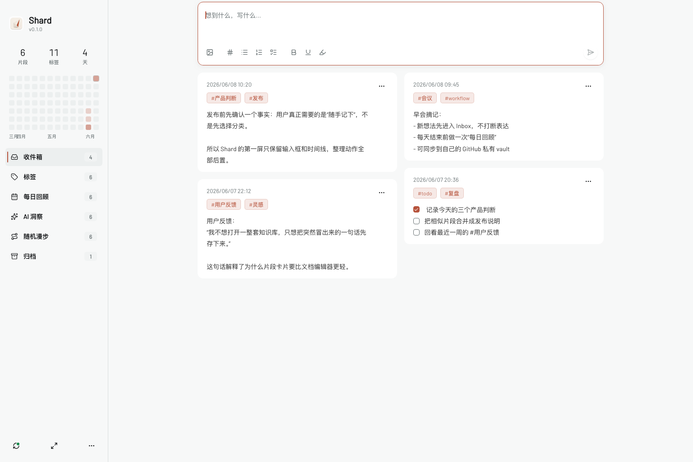

# Shard

Shard 是一个本地优先的桌面端 Markdown 片段捕捉应用，目前只发布 Apple Silicon macOS 安装包。

> 产品方向（2026-09-15）：正在设计只围绕碎片的版本，移除资料库、思维导图、画布与内置多维表格等独立模块（大纲成为碎片内容类型之一，导图是其视图，见 docs/dev/product-framework.md），加入可组合的 Git / 飞书 / 夸克存储目标和 Hermes / OpenClaw 接入。详见 [设计方案](docs/dev/fragment-only-design.md) 与 [实施文档入口](docs/dev/README.md)。目前仅完成方案整理，相关代码移除、数据迁移及新同步能力尚未实施；下文仍描述现有版本。

它借鉴了 [flomo](https://flomoapp.com/) 的核心心智：先把稍纵即逝的想法记下来，让碎片在时间流里自然沉淀，再在需要时回看、整理和连接。Shard 不是 flomo 的复刻，也与 flomo 没有关联；它把这个灵感收敛到本地优先、Markdown 优先、Git 可追踪的桌面工具里。



截图内容为示例片段，用于展示真实使用场景，不包含私人 vault 数据。

## 下载与安装

当前发布目标：

- macOS Apple Silicon，M1/M2/M3/M4 芯片
- 不支持 Intel Mac、Windows、Linux

安装方式：

1. 到 [GitHub Releases](https://github.com/wensia/shard/releases/latest) 下载最新的 `Shard_*_aarch64.dmg`。
2. 打开 DMG，把 `Shard.app` 拖到 `Applications`。
3. 首次打开如果 macOS 提示“无法验证开发者”，请右键 `Shard.app` 选择“打开”。当前版本尚未配置 Apple Developer ID 签名和 notarization。

## 适合场景

- 产品判断：先记录一个判断和它的背景，不急着写成完整文档。
- 会议摘记：把早会、复盘、客户沟通里的关键句拆成独立片段。
- 用户反馈：保留原话，再用标签连接到后续产品决策。
- 阅读摘录：记录一句启发、一个反问或一个待验证假设。

## 核心理念

Shard 只优化一个动作：快速捕捉灵感。

1. 写下一段想法、摘录、任务或观察。
2. 按 `Cmd+Enter`、`Ctrl+Enter`，或点击发送按钮保存。
3. Shard 在本地 vault 中生成独立 Markdown 文件。
4. 新内容以灵感卡片的形式进入时间线。
5. Git 在后台为这次记录留下提交痕迹。

`Enter` 或 `Shift+Enter` 用于换行，AI 标签和整理能力只作为后置工作流，不阻塞捕捉。

## 主要功能

- **灵感卡片**：每条片段以卡片形式呈现，按时间倒序查看。
- **Markdown 片段落盘**：每条记录都是独立 Markdown 文件，方便迁移、搜索和二次处理。
- **本地优先 vault**：默认写入 `~/Documents/ShardVault`，不依赖云端服务才能保存。
- **Git-backed 记录流**：保存片段后自动初始化/使用 vault 内的 Git 仓库并提交变更。
- **标签捕捉**：正文中的 `#tag` 会被提取到 frontmatter，同时默认保留 `inbox` 标签。
- **轻量导航**：支持碎片、标签筛选和回收站等入口。
- **桌面应用体验**：基于 Tauri，目标是保持快速、安静、低打扰。

## 功能状态

| 模块 | 状态 |
| --- | --- |
| 快速捕捉 Markdown 片段 | 已实现 |
| 灵感卡片时间线 | 已实现 |
| 标签提取与标签浮层 | 已实现 |
| 本地 vault 与 Git commit | 已实现 |
| Git pull / push 同步入口 | 已实现，需要用户配置 vault remote |
| 回收站软删除与深度编辑 | 已实现 |

## Stack

- Tauri 2
- React 19
- TypeScript
- Tailwind CSS 4
- shadcn/ui with Base UI primitives
- Rust filesystem and Git commands

## Development

```bash
pnpm install
pnpm tauri dev
```

Build:

```bash
pnpm build
pnpm tauri build
```

Build Apple Silicon macOS DMG:

```bash
pnpm build:mac:apple-silicon
```

Frontend-only development:

```bash
pnpm dev
```

Markdown 渲染与纯解析工具位于独立 workspace 包 [`@shard/markdown`](packages/markdown/README.md)。
主项目开发、构建和测试会先构建该包；运行 `pnpm pack:markdown` 可生成供其他产品安装的 `.tgz`。
跨产品 React、样式、业务 adapter 和 Vite Worker 的接入方式见包内文档。

## Vault

Shard stores fragments in:

```text
~/Documents/ShardVault
```

Each fragment is an independent Markdown file under:

```text
fragments/YYYY/MM/
```

Shard initializes Git inside the vault on first commit. If Git commit fails, the Markdown file still remains on disk and the app marks the card with a failed status.

Example fragment:

```markdown
---
id: 20260803-050116-e71fe4dc-c91185
created_at: 2026-06-05T00:12:00+08:00
updated_at: 2026-06-05T00:12:00+08:00
tags:
  - inbox
  - product
category: null
ai_status: none
source: desktop
---

一个突然出现的产品想法 #product
```

## 终端快捷创建

```bash
pnpm install:cli            # 构建并安装到 ~/.local/bin/shard（PREFIX 可覆盖）

shard 今天心情很好
shard #备忘 /任务列表 买咖啡   # 前导 #标签 与 /块命令，其余是正文
pbpaste | shard #摘录          # 没有内容参数时读标准输入
shard -s 银行 房贷             # 多个关键词须同时命中；不带关键词列出最近修改的碎片
shard -e 2                   # 编辑上次搜索结果的第 2 条，也可用 id 或关键词
shard --graph-read <碎片id>    # 读取受管图 JSON 与完整文件 fileSha
shard --graph-outline <碎片id> # 将大纲只读导出为两空格缩进列表
```

- 块命令与编辑器 `/` 菜单同名（含拼音缩写）：`/任务列表` `/待办` `/备忘` → `- [ ]`，`/列表` → `-`，`/编号` → `1.`，`/引用` → `>`；多行内容每行一项。
- 资料库依次取 `--vault`、`SHARD_VAULT`、App 设置里的资料库、`~/Documents/ShardVault`。
- 只写文件（`source: cli`），提交交给 App 的检查点；App 运行中切回窗口即可看到新碎片。
- `-s` 的匹配与排序规则同 App 搜索，结果序号可供 `-e` 引用；`-e` 使用 `$VISUAL`、`$EDITOR`（默认 `vi`），图形编辑器须带等待参数，如 `EDITOR='code -w'`。保存后按正文重算标签；编辑期间文件被改动时不覆盖，退出码为 2。大纲与流程图请使用图命令，密匣只能在 App 中编辑；双链关系会在 App 下次保存该碎片时更新。
- bash 等把 `#` 当注释的 shell 里给标签加引号，或用全角 `＃备忘`。`#密匣` 只能在 App 中保存。
- 图命令直接读写公开的大纲/流程图片段：`--graph-write <碎片id> --expect <fileSha>` 从标准输入读取完整图 JSON，`--graph-set-text <碎片id> <节点id> <文字> --expect <fileSha>` 修改节点文字，`--graph-add-child <碎片id> <父节点id> <文字> --expect <fileSha>` 添加大纲子节点，`--graph-remove <碎片id> <节点id> --expect <fileSha>` 删除大纲子树。
- 所有图写命令都必须使用最近一次 `--graph-read` 返回的 `fileSha`；文件已被其他进程修改时会拒绝写入。图写入只落盘，提交仍由 App 检查点聚合。

## Design

Shard uses [Kiln](vendor/kiln) as its frontend design system. Kiln owns the
shared tokens, component rules, layouts, and migration checks; Shard-specific
editor and timeline geometry lives in `src/styles/frontend-rules.css` as a
product extension rather than a second design system.

## License

License is not selected yet. Public repository visibility does not imply an open-source license grant.
