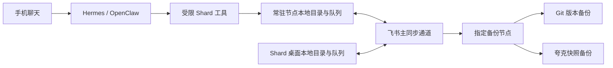

# 碎片存储、同步与 Agent 接入设计

状态：正式设计草案，尚未实施。证据核对日期：2026-09-15。

本文定义碎片内容如何离线保存、如何同时送往 Git / 飞书 / 夸克网盘，以及 Hermes / OpenClaw 如何通过同一套工具读写。产品范围与设置入口见 [碎片版产品设计](./fragment-only-design.md)，旧数据处理见 [碎片版迁移方案](./fragment-only-migration.md)。文中的新协议、命令、后台节点及配置均为拟新增能力，不代表当前 Shard 已支持。

## 1. 决策与边界

1. **本地保存始终存在。** 不登录、不联网、不配置云端也能记录、修改、搜索、查看附件。云端故障不阻塞本机保存；纯离线模式不启动任何云端同步任务。
2. **存储目标可以同时启用，但职责必须明确。** 新库默认仅本地，已有库保留当前 Git 配置，不自动开启云端。用户希望同时使用三个云端时，推荐组合为「飞书主同步 + Git 版本备份 + 夸克快照备份」。Git 可以替代飞书，单独承担双向同步。首版每个碎片库只选择一个主同步通道；同时勾选多个目标不表示它们互为独立可写主库。
3. **保留 Markdown 和普通附件文件。** 不把正文迁移成只能由某个云平台或数据库解释的格式。本地当前正文、同步修订和云端查看投影遵循同一数据模型，禁止出现两套分别编辑、不能核对的正文。
4. **保存、同步、备份分别确认。** 「本机已保存」「已写入共享同步通道」「Git 已备份」「夸克已备份」是不同结果。一个目标失败，不回滚已成功的其他目标。
5. **Hermes 和 OpenClaw 是入口。** 两者调用 Shard 的确定性工具，不能各自实现一套保存、删除和冲突规则。Skill 解释使用方式；强制权限、去重和版本校验由工具端完成。
6. **移动记录不依赖 Mac 开机。** 需要有持续在线的 Agent 运行环境；它可以同时运行无界面的 Shard 节点。桌面客户端本身不要求常驻服务器，只有「随时发消息立即处理」需要持续在线的接收端。

首版不建设实时协同编辑、CRDT、通用事件溯源平台或多个云端互相转发的同步网络。需要的是有限的待投递日志、明确的修订关系和可以恢复的快照。

## 2. 存储能力与推荐角色

| 目标 | 启用后的推荐角色 | 可编辑来源 | 双向同步边界 | 首版完成证据 |
| --- | --- | --- | --- | --- |
| 客户端本地目录 | 每个节点的离线工作副本 | Shard 编辑器、确定性工具；外部 Markdown 修改经导入检查 | 不配置云端即可独立使用 | 正文、元数据、附件和待投递信息已耐久落盘 |
| 飞书 | 主同步通道；也可配置快照备份 | 主同步由 Shard 桌面及 Agent 工具产生修订；备份仅指定节点上传 | 主同步拟用不可变修订记录交换变更；备份不导入远端修改；当前表均只作查看投影 | 同步须修订回读及另一节点应用；备份须完整快照回读与恢复 |
| Git 远端 | 版本备份；也可选为唯一主同步通道 | 备份模式仅指定备份节点写入；主同步模式允许已登记的 Shard 节点写入 | 备份模式不自动拉取远端正文；主同步模式必须处理非快进、工作树及内容冲突 | 目标提交可在远端确认；同步模式还须另一节点应用 |
| 夸克网盘 | 快照备份与恢复 | 指定备份节点上传 | 当前 CLI 可确认文件传输；Shard 双向同步协议未实现、未验证 | 完整快照清单最后发布并可回读，文件数量和校验信息匹配 |

「Git + 飞书 + 夸克」同时启用时，主通道和备份使用不同任务：源节点为本地产生的修订建立主通道出站项；指定备份节点无论应用本地产生还是主通道拉取的修订，都推进备份待处理水位，在检查点或计划时间生成备份任务。接收远端修订保留原操作 ID，不重新向主通道发布，但必须触发本节点承担的备份调度。其他节点不为同一备份目标建立逐操作上传队列。

备份任务使用稳定的 `backup_id`、覆盖修订集合和内容范围，重试复用该身份；Git 生成聚合检查点，飞书/夸克生成完整快照。所覆盖范围必须包含当前未解决分支及必要附件；尚未收齐的修订或附件不能标为完整。备份只声明已验证覆盖的状态，不声称包含其他离线节点尚未上传的内容。全库存在已知缺口时保留上次完整备份并报告待收齐。

备份节点单机默认本机，多节点时明确指定桌面或常驻节点。非备份节点只有取得含覆盖修订的可信回执才能显示该目标已备份；否则显示“等待指定节点备份”或“状态未知”，不伪装成本机 Git 待推送。无主通道时，备份节点必须实际持有待备份内容；仅夸克且指定的是关机桌面时，常驻节点只能确认“节点已保存、尚未备份”。不同不互通节点需要各自独立目标，不能把它们的局部副本称为同一个完整备份。

允许只开 Git，或只开夸克备份，或只用本地。仅配置夸克备份时，它不自动成为 Agent 与桌面间的双向通道。启停某个目标只改变后续传输，不隐式删除本地文件或已存在的云端副本。

## 3. 数据模型与本地耐久性

### 3.1 内容模型

继续以 `fragments/*.md` 保存 Markdown 正文及 frontmatter，以 `assets/` 保存普通附件。保留稳定碎片 ID、创建时间、修改时间、标签、置顶和关联 ID。相对路径用于定位，ID 用于跨端身份，改名不生成一个新碎片。

新增以下最小同步信息：

| 字段 | 含义 |
| --- | --- |
| `vault_id` | 碎片库的稳定身份；同名目录不能据此合库 |
| `schema_version` | 数据及同步载荷版本；不认识的新版本暂停应用 |
| `revision_id` | 当前完整碎片状态的修订 ID |
| `parent_revision_ids` | 此次修改所基于的修订；普通编辑一个，显式解决冲突时可有多个 |
| `op_id` | 一次持久化修改的稳定操作 ID；单碎片操作可直接用作修订 ID |
| `payload_hash` | 规范化载荷的校验值；同一操作 ID 对应不同载荷必须报错 |
| `origin_device_id` / `source_event_id` | 产生节点及可选原始消息身份，用于追溯和去重 |
| 删除墓碑 | 碎片 ID、删除修订、父修订及删除时间；不能仅以文件缺失表达删除 |

操作载荷包含该次变更后的完整碎片状态及附件引用，避免恢复依赖一长串细粒度编辑补丁。标签、置顶、关联和删除状态也参加修订校验，不能只对 Markdown 正文做版本检查。时间戳用于展示和检索，不用于裁定哪个并发修改胜出。

### 3.2 当前正文、日志与索引的关系

- **Markdown 是已应用内容的可移植表示。** 正常读写通过同一个存储核心；工具不能绕过核心改飞书记录，编辑器不能单独更新另一份数据库正文。
- **日志只负责写入恢复及可靠投递。** 日志里的修订载荷不可变，不能作为另一个编辑入口。它与 Markdown 通过修订 ID 和哈希核对，完成检查点及必要传输后可以按保留规则压缩。
- **搜索索引可重建。** 可以使用本地索引库加速搜索，但不得只在索引库保存正文、唯一队列或不可恢复的版本信息。
- **飞书当前表是查看投影。** 可以由已确认修订重建；其展示失败不抹掉已保存修订。首版不接收对该表正文列的直接修改；后续原生编辑须经过单独的导入与冲突设计。

本地状态分为可移植内容和设备私有状态。库 ID、修订关联、墓碑、恢复清单可随备份携带；每目标投递状态、远端记录映射、运行锁、临时任务和凭证为设备私有。尤其不能因当前 `.shard` 属于 Git 托管范围，就把新加的整个设备状态目录自动提交；实现时必须沿用唯一托管清单并明确排除规则，凭证保存在系统凭证存储或节点密钥配置中。

下表是拟新增协议的路径与托管约束，当前未创建或迁移这些目录。`<节点状态目录>` 默认位于 Vault 之外的系统应用数据目录，以节点 ID 和库 ID 分区；无界面节点使用等效的受限数据目录。实现不得再发明第二套 Git 托管根清单，须在现有 `MANAGED_VAULT_ROOTS` / `managed_pathspecs()` 及内容导出器中落实下表。

| 内容及路径 | Git | 飞书 / 夸克备份 |
| --- | --- | --- |
| `fragments/`、`.trash/fragments/`、被引用的 `assets/` | 保存授权范围内的普通内容、回收站及附件 | 纳入声明范围及哈希清单 |
| 拟新增 `.shard/sync/v1/`：库身份、公开修订/父关系、墓碑、已验证检查点覆盖清单 | 可移植恢复内容，不能含设备队列或凭证 | 携带恢复所需集合；不把投影当恢复依据 |
| `lockbox/` 与 `.shard/lockbox.json`；新增私密恢复载荷留在受保护范围并沿用加密封装 | 已有授权保持；新目标默认排除，验证和授权后成套保存密文与恢复元数据 | 默认排除；只有独立通过密文恢复验证且明确启用后才成套纳入，绝不只带密文正文 |
| 旧模块当前文件及既有提交历史 | 保持原仓库行为；新纯碎片目标使用独立导出集合 | 默认排除；旧资料原始包是另一个显式导出范围 |
| `<节点状态目录>/recovery/`、`requests/`、`outbox/`、`backups/`、`mappings/`、`index/`、`locks/`、临时文件 | 一律不提交；恢复日志可含待应用载荷，私密载荷必须先加密 | 一律不纳入便携备份；不得复制他机“已投递”标记 |
| 系统凭证存储或节点受限密钥配置 | 排除原始密码、明文密钥、恢复口令、云令牌 | 同左；加密封装的 `lockbox.json` 属上一行密文恢复集合，不能误删 |

备份前先完成本节点待应用日志的恢复，把已接受操作纳入可移植修订集合；不能因为节点恢复日志不随包传输而漏掉已确认保存的内容。跨文件与日志的一致性按第 3.4 节处理。阶段 A 必须核对真实 `git ls-files` 与导出清单，排除规则不能只停留在文档或 `.gitignore`；已跟踪敏感状态的旧提交还须按历史范围问题单独处理。

### 3.3 私密碎片与同步范围

产品决定为：保留私密碎片能力，取消独立密匣工作台。私密是碎片的隐私状态，继续支持创建、加密读写、解锁和自动锁定；取消独立工作台不等于删除其数据层。继续使用既有加密格式，不为本次存储设计更换算法、解密旧文件或另建一种加密格式。

新增恢复日志、临时文件和冲突副本也不得落盘私密明文；私密操作应先通过既有加密路径形成密文，再持久化恢复载荷。解锁后的内容只在现有受控读取与编辑路径使用，不能因接入日志或搜索索引增加新的明文副本。

当前 `reject_lockbox_images` 只识别整行 Markdown 图片，捕捉区还会拦截待上传图片；这些检查不能证明行内图片、引用式图片、HTML 图片或普通文件附件已经全面受控。既有格式没有给普通 `assets/` 附件提供完整加密链路。首版继续限制私密附件，并在统一存储入口补齐所有受支持附件引用的校验：私密捕捉和编辑禁用未支持的上传入口，工具拒绝追加图片或普通文件；带附件的普通碎片转私密时保留原件并阻止转换，不剥离附件后伪装成功。普通文本链接不等于附件，但私密渲染不能自动抓取外部图片或展开远端预览。第 6 节的普通附件存储规则不适用于私密内容。私密附件需要独立完成加密、引用、缓存、导出和跨节点验证后再开放。

保留既有“锁定时可投递、解锁后可读取”的区别：已配置写入公钥时，新建私密碎片可以直接加密保存；缺少写入密钥时沿用已有首次解锁流程。读取、搜索和编辑仍须解锁，锁定状态的成功回执不返回解密正文或摘要。私密目的地选择不等于打开私密阅读范围。

新连接的远端、新备份目标及 Agent 权限默认不包含私密碎片，连同可能泄露其信息的标题、标签、附件、日志载荷和冲突副本一并排除。新目标的私密同步只有在密文传输、完整性与密钥交付能力独立验证通过后，才能显示可用并由用户明确开启；不得为了飞书搜索或 Agent 摘要自动明文化。已配置 Git 的历史行为、加密文件和同步语义保持原状，不能把“新目标默认排除”表述成“现有远端从未包含”。

从私密来源生成的新碎片、摘录、摘要和关系说明继承私密属性，不能套用新建默认普通目的地。首版不向 AI 或 Agent 发送私密来源，也不在私密视图开放云端 AI 整理；解锁不是外发授权。受控本地派生产物若要公开，必须单独预览明文、来源和接收目标，由用户明确选择公开后创建新操作；在此之前不得进入普通索引或出站队列。未来私密 AI 能力需另做数据外发设计。

每个同步目标和备份清单声明自己的内容范围，以及被排除的数据类型。「完整快照」表示对其声明范围完整，不把只包含公开碎片的备份宣传成含私密内容的全库备份。迁移和恢复预览必须清楚列出未纳入范围；本方案不移除私密碎片数据能力。

**普通转私密是带队列边界的状态转换。** 在库写锁下提升该碎片的隐私状态代次，冻结其普通出站操作；未开始的普通载荷停止发送，转换前的本地可重试载荷须加密隔离或完成受控清理，不能留作明文待发送队列。已在传输的操作单独核对远端结果，无法确认时维持结果未知并向用户说明，不声称外部副本已撤回。远端已经接收的普通历史仍按既有历史说明处理，转换不承诺清除旧备份或物理擦除旧磁盘字节。

已进入普通同步域的碎片发布不含私密正文的公开退出墓碑，以便其他节点撤下公开投影；私密后续内容只在其允许的范围流动。离线节点在尚未收到退出事件前可能继续产生普通修改，这些晚到分支必须被隔离并作为冲突处理，不能自动将内容重新放回公开流，也不能把其他节点已经外发的旧明文描述为被当前节点阻止。含私密内容的后续冲突载荷仍须加密保存。

Git 提交一旦包含旧明文，取消普通文件队列不能阻止其祖先历史在 push 时上传。发生转私密且未推送历史包含旧明文时，暂停该 Git 目标，展示“继续保留历史”或“另建不含旧明文的目标”的后续选择；不得自动改写提交、强推或继续推送后宣称全部旧明文受到保护。

转换预览按每个已配置目标列出：未发送载荷、传输结果未知、已确认存在的明文修订/快照及最后核对时间。飞书明确指出不可变修订中的旧正文，Git 指出相关历史，夸克指出已确认覆盖该碎片的快照；无法枚举的部分显示未知，不能推断为不存在。转换后只能确认本节点内容已加密、普通队列已停止及已核对的投影撤下情况，不能显示“全部副本已保护”。暂停连接或新建目标都不会撤销旧副本的可读性；若用户要求处置旧副本，需另行明确目标、权限或删除范围及平台限制，不自动清理远端或承诺物理擦除。

凭据排除针对原始密码、明文主密钥、恢复口令和云端连接凭据。既有加密封装的主密钥、盐、nonce 等恢复元数据属于密文恢复集合，按现有授权和格式保留；不能把 `.shard/lockbox.json` 当普通云连接密钥删掉，也不能未经新目标授权扩大其传输范围。

### 3.4 一次本地修改

1. 存储核心验证库身份、授权、参数和父修订。在后台取得该库写锁；节点与桌面若可能打开同一路径，还必须共享一个写入服务或使用进程间锁，现有进程内 mutex 不足以协调两个进程。
2. 先将操作 ID、完整目标内容、附件清单、修订来源及主通道配置代次记录为恢复日志，并耐久落盘。所需附件先写临时文件、校验后原子替换。
3. 原子更新 Markdown / frontmatter 或墓碑，刷新对应文件与父目录并持久化可移植修订。记录操作已应用；本地产生的操作建立主通道出站项，远端应用不回传；该节点若承担备份角色，则在两种来源应用成功后都推进备份水位。备份任务按第 2 节生成，不按源节点逐条复制任务。多文件变更由同一恢复记录覆盖，不把中途状态当作成功。
4. 上述步骤完成才返回「已保存到当前节点」。UI 与 Agent 回执读取这一结果，不因任务进入内存队列就声称已保存。
5. 释放写锁后执行云端网络操作。返回远端数据准备应用时重新取得锁并核对当前修订，不能覆盖网络等待期间产生的本地修改。

启动时先恢复未完成记录：已持久化但未应用的操作可幂等补完；已应用但未写回完成标记的操作按 ID 与哈希确认；半写临时文件不替代正式内容。无法判定的记录保留现场并报告，不通过删除日志“修好状态”。

外部编辑 Markdown 由后台文件检查发现：读取上次已知修订和文件哈希，将变化导入为一个新操作。无法解析、出现重复 ID 或缺少基线时进入待处理项，禁止直接上传覆盖云端。首次接入旧库以受控导入建立基线，具体迁移由迁移文档定义。

## 4. 目标队列、重复投递与冲突

### 4.1 每个目标单独记录结果

主通道的操作任务与指定节点的备份任务分别按目标维护 `pending → transferring → verified` 状态，也可以进入 `retry_wait`、`auth_required`、`conflict` 或 `outcome_unknown`。主通道核对 `op_id`，备份核对 `backup_id` 及其覆盖集合。记录最近成功凭据、重试时间及错误原因；切换窗口、退出进程或重启机器后仍能继续。目标 ID 绑定具体账号、库和远端位置及配置代次；更换账号或目录不能让旧队列自动发往新目标，须经过明确的重新绑定或迁移步骤。

网络超时发生在写操作之后时，先按稳定操作 ID 核查远端，再决定重试。若远端没有原子幂等创建，允许出现相同操作 ID 的物理重复记录，但所有消费者只应用一次；相同 ID 的不同载荷进入异常隔离。不能因为 CLI 命令名含有 `upsert` 就假定业务键唯一。

失败按目标退避重试，不重复发送成功目标。认证失效暂停该目标并保留队列；读取空结果、分页失败、权限被撤销和附件访问失败都不能推导为用户删除。只有有效墓碑表达删除。

### 4.2 防重放和防循环

- 桌面创建操作 ID 后先持久化，重试复用。聊天请求使用库 ID、平台、租户、会话、原始消息 ID 及消息内动作序号形成稳定去重键；两个 Agent 处理同一个来源事件时仍对应同一操作。
- 节点产生的普通操作使用全库唯一的随机 ID，并检查碰撞；不能仅使用时间戳或节点内自增数。聊天工具缺少可信来源键时返回 `idempotency_key_required`，不创建文件、修订或出站项，也不替模型补一个随机键放行。飞书统一使用平台租户、`chat_id`、原始 `message_id` 与稳定动作序号，外加绑定库和平台命名空间；不得改用 Hermes/OpenClaw 各自的会话 ID、重试 ID 或模型消息 ID。
- 两个 Agent 处理相同消息时，首版共同接入同一受限写入服务，由渠道适配层登记来源，存储核心在事务或写锁内持久化唯一请求记录及首次接受的动作和结果。动作序号来自这份稳定计划，不由每次模型推理重新编号。同键但内容、目标或动作不同返回 `idempotency_conflict`，不执行第二次写入。分别部署的 Agent 仍转交这一消息写入节点；其不可达时保留待处理或返回未保存，不让两端离线各自解释同一消息。可靠接收与重试需要持久化可信消息封装；平台事件确认、任务入队不能替代碎片落盘回执。
- 对同一去重键返回原来的操作结果。用户有意再次发出同样文字、但消息 ID 不同，可以产生新碎片，不能仅用正文哈希去重用户记录。
- 从主通道拉取的操作保留原 `op_id` 和来源，不重新包装为本地新操作后回传；这不禁止指定备份节点为已应用内容生成检查点或快照。下载附件、重建索引和更新远端映射也不生成正文变更。
- 使用每设备已应用集合或检查点覆盖信息压缩去重状态。不得仅以“时间早于上次同步”拒绝变更，否则离线设备和时钟漂移会丢记录。
- 首版不把 Git、飞书、夸克同时设成自动导入来源。以后增加第二主通道必须另做桥接协议及循环验收，不能开放三个任意双向开关后让适配器自行协调。

### 4.3 父版本与删除语义

修改基于当前已知父修订时正常应用。两次操作基于同一个父修订、但互不包含对方时，形成并发分支：保留双方内容，标记待解决；不能使用更新时间或最后抵达顺序覆盖。首版不自动用模型改写合并正文；解决结果是一条显式包含双方父修订的新操作。

乱序收到子修订而父修订缺失时先等待补齐，并报告该库未收齐，不能把子修订当作独立新碎片。缺失父修订可能由已验证完整快照解释；此时以快照覆盖清单核对。

删除是带父修订的操作。本地可以将内容移至回收站，但跨端传播依靠墓碑。删除与并发修改同时发生时保留修改内容并提出冲突，不静默复活，也不直接销毁。恢复产生基于删除修订的新操作。

墓碑不能按固定天数无条件清理。只有登记设备都已越过包含该删除的检查点，或用户明确退出旧设备并完成新的恢复基线后，才允许清理。长期离线设备在被退出后重新接入须从新基线恢复；其旧操作先检查、再由用户决定导入，不能自动复活已删除内容。

首版默认保留墓碑及其必要修订依据，不自动执行上述设备退役、去重压缩或语义历史垃圾回收；快照生成不等于获得清理许可。只有设备确认、退出与新基线恢复门禁单独验收后才能启用压缩。达到容量上限时展示具体目标和暂停的操作，保留既有数据，不通过静默清理解决容量问题。已验证备份快照的保留策略仍按独立规则执行。

## 5. 三类远端适配

### 5.1 飞书：主同步通道或快照备份

飞书适配器通过 `lark-cli` 的结构化接口访问专用 Base 和附件。CLI 是传输层，Shard 负责操作身份、修订、队列和冲突。

**主同步模式**采用两类记录：

| 记录 | 用途与写入规则 |
| --- | --- |
| 不可变修订记录 | 每次完整碎片变更独立创建，携带 `op_id`、父修订、载荷及哈希；成功后不原地改写 |
| 当前碎片表 | 提供正文、标签、时间和来源等查看字段；由一个指定投影写入者更新，失效可重建，不作为同步判定依据 |

选择不可变修订是因为当前已核对接口没有足以确认的比较并交换能力。给可变记录增加 `base_revision` 字段，再进行“读取后更新”，无法阻止两个节点都通过检查后相互覆盖。独立修订使双方结果都能被读取，再由 Shard 判断冲突。

首版把原始 Markdown 作为原文保存，不承诺飞书多维表格能无损提供与 Shard 一样的富文本编辑。长正文和二进制附件拟使用文件载荷，必须先针对目标账号验证上传、下载、大小与授权限制后才能启用，表中保留定位信息及哈希；超限时明确失败或使用已经通过验证的文件路径，禁止截断保存。纯图片或附件消息同样生成一条有明确附件清单的碎片。

已核对的 `+record-list` 分页是列表分页，不是持久化变更游标。首版允许后台分页轮询不可变修订并按操作 ID 去重，必须检测分页未完成、重复页和权限失败；并发新增造成列表位移时通过重叠扫描及后续完整核对补齐。数据量增长后再按已验证检查点和受控分区缩小扫描范围，不把最后一个 offset 保存为永久同步位置。

不依赖尚未验证的飞书原生变更事件。后续若接入事件，事件仅用于触发拉取，仍保留完整核对。首版飞书表内直接编辑和手工删除不是受支持的双向入口；推荐通过聊天或 Shard 修改。需要原生输入时，后续优先增加独立「待收录」入口，导入后生成新操作，避免用户无意修改投影破坏同步。

这里的「不可变」是 Shard 写入协议，不表示飞书平台禁止用户手工改表。每次读取修订要核对已知操作 ID、载荷哈希及父修订；已知记录内容改变、记录缺失或恢复清单不完整时暂停相关应用并提示完整性异常，不把篡改当正常新修订或把缺失当删除。当前投影若被人工编辑，与上次由 Shard 写入的投影哈希不同，应暂停该行投影更新、保留差异并提示处理，不能静默刷回旧内容。后续导入人工修改须先展示预览，再显式创建修订。

完整性核对依赖已知修订、本地记录及已验证快照；记录中可以和正文一起改写的哈希不是可信签名，不据此承诺平台数据不可篡改。

**备份模式**用于 Git 主同步或本机离线库仍需保留飞书副本的组合。指定备份节点按第 2 节生成带稳定身份的完整快照，保存 Markdown、附件、未解决分支、墓碑和必要修订基线；在独立备份目录/表中最后发布完整清单并回读验证。所需文件载荷通过上述技术验证前，该模式不可启用。备份不逐条接收其他节点的新修订，不把飞书表编辑导入活动库，也不建立第二个主通道；备份中携带的修订仅用于恢复。

飞书查看投影可以从最后一个已验证快照重建，但查看表本身不是完整备份。显示覆盖修订、更新时间和执行节点；无法确认节点最新状态时显示最后已知状态或待更新，不承诺包含未获取的变更。主同步与备份分别绑定目标命名空间和配置代次。飞书备份升为主通道必须执行第 6.2 节切换，不能直接把投影或旧备份进度当作已同步基线。

### 5.2 Git：版本备份或唯一主同步通道

**备份模式：** 指定一个备份节点，把已保存内容和恢复所需元数据生成聚合检查点后推送。其他节点不对同一备份分支独立写入；远端出现非预期分叉时停止并提示，不强推覆盖。若用户在远端编辑文件，备份模式不会自动将它导入当前库；改用恢复预览或显式切换主同步模式。

**主同步模式：** 不配置飞书也能在多台 Shard 与常驻节点间使用 Git。交换内容同时保留操作 ID、父修订和墓碑，远端变更在隔离的临时工作区中读取与校验，再通过存储核心应用到活动库。非快进时先取回缺少操作再重试推送；同一碎片并发修改进入内容冲突，不把 Git 文本合并成功等同业务语义正确。

当前代码的聚合检查点、托管路径、工作树状态和冲突检查可以复用，但现有 `pull --rebase --autostash` 不能被当作已经完成上述协议。当前 `ls-remote` 和 `push` 位于写入门外，`pull --rebase --autostash` 仍整体持门；拆分远端获取与本地应用是待实施要求。尤其要避免直接拉取改写有草稿的活动工作树，或者中止不属于 Shard 的外部 Git 操作。主同步模式正式上线前必须补齐该链路。

正文保存仍只落盘，不在每次输入后内嵌提交；继续遵循现有 `checkpoint_vault` 聚合与结构操作前检查点规则。附件仍可作为普通文件入库，设置目标前展示体量；不在此设计里自动引入 Git LFS 或更换远端。

已有 Git 仓库可能包含资料库、画布、密匣等旧模块的当前文件和历史提交。保留原 remote 与历史时，不能承诺一次后续 push 不会携带这些旧历史；只缩小新的托管目录白名单无法消除提交祖先中的内容。新连接的纯碎片目标才使用明确的碎片内容范围；用户若要求新远端完全不含旧模块历史，应从审核后的导出集合另建纯碎片仓库。不能自动用 `filter-repo`、强推或历史重写“净化”现有仓库。

### 5.3 夸克：快照备份与恢复

当前本机官方 Skill 可确认上传、下载、目录分页列表和文件元数据。上传支持断点续传与逐项结果；下载有覆盖本地文件选项。未确认远端文件原子覆盖、历史版本 API、条件更新或普通文件变更流。分片上传中的 `etag` 不等同远端文件版本前置条件。

首版为每个快照生成唯一名称，上传 Markdown、附件、墓碑和恢复清单。快照可以打包；清单记录库 ID、格式版本、快照 ID、内容哈希、文件大小、创建节点、完整性及所覆盖修订。全部数据对象完成后才最后发布完整清单，再读取验证，作为该次备份完成标志。中途退出留下的不完整快照不会成为默认恢复候选。

不反复覆盖 `latest.zip` 或单一可变总索引；可以有便于查找的最近快照指示，但恢复不能只信任它。保留策略只处理本产品创建且身份匹配的快照，不删除用户网盘中的其他内容。删除过期快照是独立、可配置的清理任务，备份失败时不先删除旧快照。

后续可以验证夸克上的不可变操作文件协议：按唯一操作 ID 创建变更文件，按本产品计算的哈希存附件，轮询目录并去重，再由同一存储核心应用。必须先验证重复上传、超时后状态核对、目录分页与可见性、授权续期、容量及限流；通过后才能将夸克开放为唯一主同步通道。这个协议属于拟新增的 Shard 能力，不能标注为夸克 CLI 自带双向同步。

## 6. 附件与恢复

### 6.1 附件可移植

本节适用于普通碎片，私密附件遵循第 3.3 节限制。正文内引用稳定附件身份或可导出的相对路径；本地文件按内容哈希归档。云端对象标识保存在目标修订/备份清单与设备映射缓存中，临时下载地址只作运行时传输用途；它们不反向决定碎片或附件身份。不能把有时效的云端 URL 写成唯一附件引用。

上传时先确认目标附件对象，再发布引用它的完整修订。下载到临时位置后重新计算本产品的哈希，校验通过才原子移入 `assets/`。单个附件失败时保留其正文和失败状态；不能把“正文已收到”显示为“含附件完整同步”。用户在本机看到已存在附件不受远端失败影响。

目标上的修订或备份清单必须携带足以定位对象的非凭据标识及校验信息，或可验证的相对对象路径。它与设备私有的映射缓存不同；丢失原设备缓存后，仍能用新节点的合法授权和清单下载内容。便携导出包则包含实际文件，不要求离线读者持有云端登录态。

删除碎片不立即删除其附件。回收站、并发修订、尚未确认的设备和保留快照都可能引用文件；只在这些引用及保留条件都满足时做垃圾回收。已下载完整的导出备份包必须让一台没有飞书、Git 或夸克登录状态的机器仍能恢复正文和已纳入的附件；从云端获取备份仍需要目标的合法访问权限。

### 6.2 恢复和主通道切换

恢复先下载到新目录，验证库身份、格式版本、清单、全部文件哈希、附件引用和墓碑，再提供条目数及冲突预览。不得直接覆盖正在编辑的库。用户可以打开恢复目录，或明确选择合并；旧库保留为恢复点。

完整快照携带当前内容、未解决分支及必要修订基线。压缩日志只在快照经过验证、必要设备已确认后发生，未投递操作和未解决冲突不能丢弃。早期版本可采用保守保留与明确容量上限，不为节省空间提前删除恢复依据。

恢复后的新节点生成自己的设备 ID，不复制旧节点的凭证、运行锁和“已投递”标记。选择续接原库时核对远端基线；选择恢复为独立库时生成新的库 ID，防止把旧快照中的状态自动推回原云端。

切换主同步通道采用明确流程：保持本地可保存 → 暂停旧通道出站 → 收齐或列明未确认项 → 生成并验证快照 → 导入新通道 → 比对条目、附件、墓碑 → 更新通道配置 → 恢复出站。未收齐时允许用户稍后继续，不自动启用两个主通道过渡；旧通道保留到切换验证完成。

切换主通道、备份写入者、飞书投影写入者或聊天消息写入节点，均须由原角色确认停止并核对最后任务与新节点基线；主通道切换须所有已登记写入节点确认暂停。节点离线或传输结果未知时，首版保持切换未完成，本地继续保存；不自动接管，不在旧节点仍可写时承诺已切换。新配置使用新的通道/角色代次，晚到的旧代次任务先隔离核对，不能直接写入新目标。失联节点强制退役与自动故障切换是后续能力。

## 7. Hermes / OpenClaw 与常驻节点

### 7.1 统一确定性工具

拟新增无 UI 的 Shard 工具入口，桌面端和节点复用同一存储核心。Hermes / OpenClaw 的 Skill 只把用户意图映射为以下操作；可以通过受限 CLI、工具服务或宿主支持的 MCP 适配接入，具体传输方式在实现阶段选定。

| 操作 | 最小输入 | 返回与约束 |
| --- | --- | --- |
| `fragment.create` | 绑定库、原文、可选标签/附件、可信来源去重键 | 碎片 ID、修订、落盘节点、各目标状态；缺键拒绝，同键同动作返回原结果，同键异动作返回冲突 |
| `fragment.get` / `fragment.search` | ID 或查询、数量上限 | 原文、来源引用、修订及查询节点最近收齐时间；不承诺尚未拉取的内容可搜到 |
| `fragment.update` | ID、预期修订、具体修改、去重键 | 新修订；基线过期返回冲突，不自动覆盖 |
| `fragment.delete` / `fragment.restore` | ID、预期修订、去重键 | 新墓碑或恢复修订；首版不向 Agent 提供永久清除 |
| `fragment.attach` | ID、预期修订、附件字节或已验证本地句柄、去重键 | 新修订及附件状态；不接受任意路径遍历 |
| `sync.status` / `sync.retry` | 已配置的目标 ID、可选操作 ID | 明确到节点和目标的状态；不能借此更换账号、目录或主同步通道 |

更新和删除不能只传一句模糊自然语言让工具再次猜测目标。Agent 必须先定位稳定碎片 ID；「刚才那条」由会话中上一次成功回执的 ID 解释。引用不唯一时澄清目标。记录默认保留原话；自动标签、摘要单独记录来源，不能覆盖原文。

批量修改与永久清除不是首版基础操作。用于讨论的总结默认只生成回答；用户要求保存总结时才创建新碎片并保留来源关联。Agent 的聊天历史和长期记忆不作为正式碎片库。

### 7.2 权限和回执

节点将已验证的聊天用户身份绑定到指定库和操作权限，默认支持读取、创建；修改、删除按用户配置开放。库身份由工具凭证绑定，不能仅相信模型传入的路径、租户或库 ID。消息来源 ID 经渠道适配器生成，不能允许模型伪造别人的回执或操作归属。

规则由工具端校验；仅在 Skill 写一句“不得删除”不构成权限控制。云端凭证由受限工具进程保管，不作为正文、模型上下文或工具输出返回。若通用 Agent 同时拥有整个主机的 shell 和云端凭证，这种隔离并不成立，部署时必须用独立进程身份或独立工具服务落实权限边界。

独立进程本身不足以隔离同一系统账号。阶段 C 必须验证不同系统身份、容器权限或远端服务等实际隔离：Agent 的 shell 无法直接读写受限 Vault、节点队列和连接凭据，也不能提权冒充工具身份；所有数据操作走绑定主体的工具。设置显示实际执行节点、权限身份和验证状态；只读/禁止删除的承诺在这种检查通过前不能标为生效。跨聊天读取还要核对接收会话：个人碎片不能仅因发送者有权就自动回到多人群聊；群聊未明确授权时转到已绑定私聊或拒绝输出。

回执至少包含落盘位置和主同步状态，例如：

- 「已保存到 Shard 节点。飞书同步已完成；桌面上线后可获取。」
- 「已保存到 Shard 节点。飞书暂不可用，已保留待同步任务。」
- 「正文已保存，1 个附件仍待上传。」
- 「修改与桌面版本冲突，两个版本均已保留，尚未替换当前内容。」

只有另一设备实际确认应用后，才可说它已经收到；远端写入完成不能直接写成“你的电脑已同步”。Git 和夸克备份状态由工具返回并可查询，通常不需要让每条聊天回执列出全部正常目标。

### 7.3 节点拓扑和可达性

下图以飞书主同步、Git 和夸克备份的推荐组合为例；更换主通道时相应调整连接角色，不同时启用两个主通道。

常驻节点可以与 Hermes 或 OpenClaw 共用已在线的服务器，不强制另购一台服务器，也不依赖 Mac。节点有自己的本地副本、恢复日志和目标队列；新消息首先存到节点，随后经共同主通道传到桌面。两个 Agent 接入同一受限消息写入服务；Agent 分别部署不改变第 4.2 节的统一去重与执行约束。普通桌面编辑仍可各自在本地离线产生修订。

| 部署组合 | Mac 关机后发消息 | 桌面获取方式 |
| --- | --- | --- |
| 常驻 Agent 节点 + 飞书主同步 | 可以保存到节点并写共享通道 | 上线后从飞书拉取 |
| 常驻 Agent 节点 + Git 主同步 | 可以保存到节点并推送共享远端 | 上线后从 Git 拉取 |
| 只有运行在 Mac 的 Agent | Mac 离线期间不能即时处理；渠道历史消息是否可补取需另验 | Mac 再运行后按渠道实际能力处理，不能承诺自动补齐 |
| 常驻 Agent 节点 + 仅夸克备份 | 节点可记录；只有它同时承担该备份角色且完整上传成功，才能确认夸克已备份 | 手动导出/导入，或先增加已支持主通道；指定另一离线节点备份时仅确认已保存，不能把恢复快照当即时同步 |
| 桌面纯离线，所有外部目标关闭 | 桌面自身完整可用；手机消息无法写入关机且不可达的桌面 | 明确导入，或用户另行开启通道 |

飞书机器人本身是消息渠道，不表示已启用飞书内容存储；用户可以通过飞书聊天，让 Agent 节点写入 Git 主同步库。反过来，选择飞书存储也不自动安装、启动或授权任何 Agent。

节点与桌面直连可作为后续可选同步通道，例如通过已授权网络上的受认证接口交换同一操作载荷。但 Shard 目前没有该协议；本文不把它算作仅夸克备份或纯离线组合已经具备的能力。直连同样不能连接一台关机的 Mac，只能等待它重新上线。

## 8. 版本目标与上线条件

下表为首个完整版本内部的实施阶段，不是当前应用已发布版本号。A 至 D 全部属于该版本的目标范围；单个阶段完成只能报告相应能力，不能将飞书先行接通描述为整个首版已经完成。E 为明确后续扩展。

总实施顺序以迁移方案的 0–5 为准：阶段 0–3 完成产品收敛与恢复准备；下表 A 是贯穿这些阶段并先于连接接入完成的数据基础，B–D 是迁移阶段 4 的内部拆分；最后统一进入阶段 5 验收。三份文档不代表三套独立排期。

| 阶段 | 可交付目标 | 必须先通过的验证 |
| --- | --- | --- |
| A：离线基础 | 收敛碎片数据；稳定 ID、附件、修订基线、恢复日志及每目标状态；云端关闭时完整可用 | 断网保存、进程崩溃恢复、外部修改导入、旧库副本迁移 |
| B：多目标存储 | 飞书不可变修订双向同步及单独快照备份模式；Git 版本备份；夸克完整快照备份；三个目标独立开关与结果 | 两桌面离线并发、父修订缺失、分页变化、附件中断、手机修订进入备份、单目标失败、恢复到新目录 |
| C：一句话入口 | Hermes 和 OpenClaw 共用工具与消息写入节点；常驻节点支持创建、查找、明确修改、删除与恢复；聊天回执准确 | Mac 关机完整链路、缺键拒绝、双 Agent 并发与异动作冲突、实际系统身份和 shell 隔离、节点重启 |
| D：替代主通道 | Git 可独立承担主同步；主通道切换流程及节点备份角色切换 | 非快进、外部 Git 操作、草稿不丢、删除与编辑冲突、切换失败可恢复 |
| E：按需扩展 | 经验证的飞书原生输入导入、夸克双向协议或节点直连 | 各项单独技术验证和真实跨设备验收，通过哪项才开放哪项 |

飞书、夸克实际接口的文本/附件限制、分页边界、限流和授权续期必须在适配实施前针对目标账号及已锁定 CLI 版本验证。不能把“官方有该命令”或本地模拟测试作为生产同步验收。

## 9. 验收用例

| 场景 | 验收结果 |
| --- | --- |
| 所有云端关闭，断网创建及编辑带图碎片，重启 | 正文、标签、附件均存在；可以搜索；没有等待登录的阻塞 |
| 在日志落盘、附件替换、正文替换、完成标记各阶段强制终止 | 重启后恢复到明确状态；不丢已确认保存，不产生半条碎片 |
| 飞书成功，Git 失败，夸克仍上传 | 飞书结果保持成功，只有失败目标重试；本地编辑继续可用 |
| 云端已创建修订但响应丢失，重复提交同一请求 | 最终仅应用一次；同 ID 不同载荷报错，不发生隐式覆盖 |
| 两桌面离线修改同一父修订，反向顺序上线 | 两端最终看到相同的未解决分支；双方原文完整保留 |
| 一端删除，另一端离线修改后上线 | 墓碑和修改都保留，进入冲突；不静默销毁或复活 |
| 子修订先到、父修订随后到 | 先等待再应用；不能因抵达顺序产生额外碎片 |
| 飞书分页途中新增、删除查看投影、读取权限被撤销 | 后续核对补齐真实修订；投影删除与权限变化不转换为墓碑 |
| 用户手工修改飞书修订记录或当前投影 | 修订完整性异常被检测并停止应用；投影差异被保留并暂停覆盖，不静默改回 |
| 附件上传一半断网，恢复后下载至新设备 | 断点或重试不破坏原文；最终哈希一致；缺附件期间不显示完整同步 |
| Hermes / OpenClaw 收到同一消息重放 | 使用相同来源去重键，返回同一碎片；不会因换 Agent 重复创建 |
| 两 Agent 并发处理同一消息、缺少来源键或对同键提出不同动作 | 唯一请求记录返回同一结果；缺键拒绝且无文件写入；异动作报冲突，不二次创建；重启后结果仍可核对 |
| Mac 关机，手机发一句话，再开启桌面 | 常驻节点先给准确回执；桌面经主通道获取同一 ID、原文和附件 |
| 只有夸克备份，没有主通道 | 明确显示不具备自动跨节点同步；不出现“桌面已收到”的虚假回执 |
| 手机创建带附件碎片，桌面作为备份节点重新上线 | 桌面拉取保留原操作 ID 并生成自身备份任务；Git / 夸克的已验证备份实际包含该修订和附件，其他节点不重复上传 |
| 仅夸克且备份执行节点不是持有新内容的常驻节点 | 回执仅确认常驻节点已保存、未备份；不会替关机桌面报告夸克成功 |
| Git 主同步同时启用飞书快照备份 | 飞书快照可恢复正文、附件、分支和墓碑；表格人工改动不导入活动库；升为主通道必须完成切换 |
| Agent 无删除权限但模型调用删除工具 | 工具端拒绝，库与云端均无删除写入；Skill 文本不能绕过此校验 |
| 受限 Agent 尝试用自身 shell 读取凭据或直接修改 Vault | 操作系统或服务权限实际拒绝；同账号进程隔离不能冒充通过，不能仅凭工具拒绝响应验收 |
| 有读取权的用户在未授权群聊请求个人碎片 | 不向该群返回正文、标题或来源预览；通过绑定私聊或明确拒绝处理 |
| 新目标和 Agent 默认接入含既有私密碎片的库 | 私密正文、标签、附件、日志与冲突副本均未进入新目标；既有加密读写仍可用 |
| 私密模式追加行内/引用式/HTML 图片、本地文件附件，或带附件普通碎片转私密 | 统一入口拒绝未支持能力，保留原件和草稿；没有私密附件明文落入公开 assets 或自动远端预览的旁路 |
| 锁定状态通过已配置写入公钥投递私密碎片 | 可加密保存，回执不泄露正文摘要；读取、搜索和修改仍需解锁 |
| 私密来源触发 AI 整理、本地派生另存，以及私密视图下选择普通目的地 | AI/Agent 不收到私密来源；派生默认私密；明确公开或普通保存确认前不进入普通索引、文件或队列 |
| 有待发送修订、传输中操作和未推送 Git 历史时转私密 | 普通待发送队列停止，结果未知被核对；含旧明文 Git 目标暂停并说明，晚到公开分支不复活 |
| 已含明文的飞书修订、Git 历史及夸克快照对应内容转私密 | 预览逐目标指出已知明文副本和未知状态；暂停或新建目标后仍说明旧副本存在，不显示全部受保护 |
| 核对 Git 实际跟踪与快照导出清单，恢复到无设备缓存的新节点 | 只含声明范围与可移植恢复依据；无节点请求日志、队列、锁或明文凭据；密文范围启用时 lockbox 恢复集合完整 |
| 既有 Git 历史含旧模块，用户要求新远端仅碎片 | 展示历史范围差异，使用审核导出后新建仓库；不改原 remote、不重写或强推旧历史 |
| 合法下载完整夸克或 Git 备份后，在无云端登录状态的机器恢复 | 全量校验通过后可离线打开；无云端临时 URL 依赖；不复用旧设备凭证 |
| 切换主同步通道时新通道导入失败 | 本地内容和待投递日志不丢；旧通道及快照可用，切换保持未完成 |
| 切换主通道或角色时旧节点失联，随后带旧任务返回 | 切换未确认前不出现两个活跃角色；本地仍可保存；旧代次任务不得直接投递到新目标 |
| 大库同步、哈希、Git 操作与 CLI 调用同时进行 | 所有重操作在后台；输入与本地保存可用，网络阶段不长时间持有库写锁 |

上线验收必须覆盖真实的两个独立节点、真实目标账号及恢复演练。测试库结果与用户正式库操作分开；本文没有授权实现、认证、实际同步、部署或迁移正式数据。

## 10. 证据与待验证事项

以下证据截至 **2026-09-15**。代码路径按本次工作区静态读取记录，后续实现前需重新核对；当前已有脏文件未因本设计改动。

| 来源 | 已确认内容 | 不能据此认定的内容 |
| --- | --- | --- |
| [`src-tauri/src/lib.rs`](../../src-tauri/src/lib.rs)，`Fragment` / `FragmentFrontmatter`、`sync_vault`、`push_vault`、`checkpoint_vault` | 当前文件型碎片模型、内容基线 SHA、后台命令、库写门、聚合检查点及 Git 同步路径 | 持久化多目标队列、本文修订协议、飞书/夸克/Agent 适配已经完成 |
| [`AGENTS.md`](../../AGENTS.md) 与 [合并保存方案](../design/commit-coalescing-plan.md) | 内容落盘与 Git 提交解耦；托管路径统一；网络和重操作在后台 | 新后台节点可直接复用进程内写锁协调多个进程 |
| [larksuite/cli 官方仓库](https://github.com/larksuite/cli)；本机 `lark-cli 1.0.69` 的只读帮助核对 | Base 记录管理、文件传输、Markdown 与结构化输出；`+record-upsert` 未传 record ID 时创建记录；`+record-list` 为 offset 列表分页 | 按业务键原子 upsert、跨记录事务、记录 CAS 或永久增量游标 |
| [OpenClaw 飞书渠道](https://docs.openclaw.ai/channels/feishu)、[Skills](https://docs.openclaw.ai/tools/skills) | 飞书机器人入口、WebSocket 接入及 Skill 机制 | Shard 已有插件、工具权限已强制落实或消息会自动写入碎片库 |
| [Hermes 飞书渠道](https://hermes-agent.nousresearch.com/docs/user-guide/messaging/feishu/)、[Skills](https://hermes-agent.nousresearch.com/docs/user-guide/features/skills/) | 飞书机器人入口、WebSocket 接入及 Skill 机制 | Shard 已有适配、关机 Mac 可被直接写入或历史消息必然补齐 |
| 本机官方 `quarkclouddrive` Skill 1.0.20、CLI 1.0.20-5be3987 的静态文档和源码 | `file-upload.md` 第 3、38–67、120–122 行：上传及断点续传；`file-ops.md` 第 50–69 行：直接子项分页；`file-search.md` 第 94–108 行：实际返回的 FID/哈希/时间元数据；CLI 第 91 行：下载本地覆盖 | 云端原子覆盖、版本前置条件、普通文件变更流、可靠双向同步 |

夸克本机证据目录为 `/Users/panyuhang/.codex/skills/quarkclouddrive/`；这里只读取 Skill、references 与代码，没有读取账户配置或 token。用户提供的 [夸克官方介绍页](https://b.quark.cn/apps/quarkcloud_skill_info/routes/V-sc7gOBT) 本次可以打开，但未提取出可逐项核对正文，因此不用于扩张能力承诺。

仍需技术验证的项目明确归入实现阶段：飞书不可变修订的分页收敛与大小边界、快照压缩及设备确认、聊天去重键映射、CLI 版本固定与错误分类、夸克完整快照回读和恢复。未验证项不得在产品中提前显示为稳定能力。
