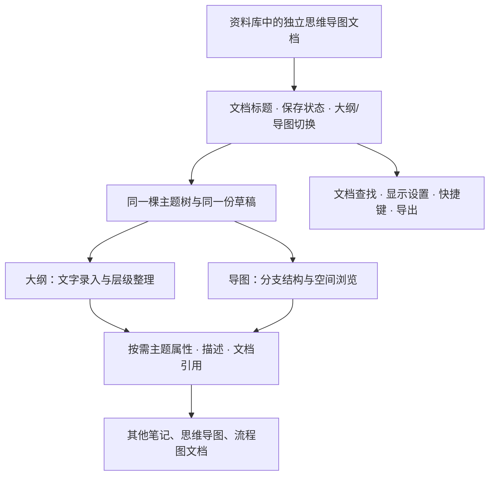

# 幕布设计拆解与 Shard 对照

日期：2026-09-08。对象：用户提供的幕布文档所在的当前桌面网页编辑器。方法：连接实际已登录 Chrome，逐项打开界面、读取可访问性树、观察截图，并对大纲做只读 DOM 几何测量；官方资料和 Shard 源码分别由并行任务核对。

本轮交付是设计调研与候选实施计划，没有修改 Shard 产品代码。这里的「已查看」指实际打开相应界面，「已验证」只用于确实完成的操作链路；菜单存在不等于编辑、保存、导出均已验证。本文不记录用户正文。

配套文档：[官方参考与资料冲突](mubu-official-reference.md)、[Shard 当前能力](mind-map-current-capabilities.md)、[分期实施清单](mind-map-mubu-improvement-plan.md)。

## 1. 判断

幕布最值得借鉴的是以主题树组织内容，以及围绕这棵树设计的连续编辑、局部聚焦和渐进显示。大纲负责表达、整理层级；导图负责观察结构、操作分支。它们共享内容，同时具有各自的操作语义。

对 Shard 的方向建议：**文档为载体，主题树为核心，大纲与导图为两种编辑视图，属性按任务展开。** 思维导图与流程图继续分别保存，通过文档引用相连。不能因为增加逻辑图、时间轴等树布局，就重新引入混合无限画布。

需要同时保留此前用户要求的 XMind 式导图选择与创建体验，以及幕布式大纲层级整理。具体键位必须形成统一状态表，不能简单把其中一款软件的全部键位覆盖到所有输入框。

## 2. 覆盖范围与证据

| 编号 | 检查对象 | 本轮结果 | 未覆盖边界 |
| --- | --- | --- | --- |
| M01 | 整体工作区 | 已查看左侧资料导航、文档面包屑、保存状态、顶部工具、中央正文、右缘目录提示 | 没有检查全部资料库文档 |
| M02 | 创建入口 | 已展开「新建文档 / 新建文件夹」 | 未创建；可编辑测试文档仍待授权 |
| M03 | 产品菜单 | 已查看账号、外观、通知、帮助、更新、下载、锁定等分组；外观有浅色/深色/跟随系统 | 未改账号或应用设置、未开通会员 |
| M04 | 大纲默认排版 | 已测字号、行高、内容宽度、缩进；主题无常驻输入框边框 | 未测多行超长正文、窄窗口、字体加载失败 |
| M05 | 大纲主题菜单 | 已打开整主题操作菜单：标题级别、基础格式、颜色、高亮、描述、图片、待办、图标、表格、复制、主题链接、导出、删除 | 未执行内容变更 |
| M06 | 图标面板 | 已查看搜索、随机、常用图标和分类网格 | 未选择图标；未验证搜索结果 |
| M07 | 快捷键帮助 | 已打开右侧帮助并读取全部快捷键分组 | 结构键、光标中间拆分、中文输入法等未做编辑实验 |
| M08 | 子树聚焦 | 已点击主题圆点：进入子树、标题变为当前主题、URL 加主题片段、统计变为局部范围；面包屑返回整文 | 未验证主题删除后旧链接、跨文档主题链接稳定性 |
| M09 | 查找 | 已搜索存在文本：命中内容高亮，正文只显示命中主题及祖先；无匹配有明确空态；关闭恢复整文 | 未验证折叠祖先、多命中循环、描述命中、图内查找 |
| M10 | 替换入口 | 已展开替换输入和上一处/下一处/替换/全部替换 | 未执行替换 |
| M11 | 折叠范围菜单 | 已查看全部、一级、二级、三级主题及各自快捷键 | 未改变原文档折叠状态，未验证折叠存储 |
| M12 | 显示设置 | 已查看宽度自适应、纸张背景、行间距宽松、缩略图模式、描述显示、字体大小 | 未应用设置；不能据菜单推断具体效果 |
| M13 | 功能开关 | 已查看大纲目录、快速菜单、悬浮菜单、拼写检查、Markdown | 未更改开关 |
| M14 | 大纲/导图切换 | 已在同一文档往返切换；主题仍对应同一层级结构；图中选过的主题返回大纲时可见行高亮 | 未验证长文档滚动位置或复杂选区保留 |
| M15 | 导图默认画面 | 已查看中心主题、两侧主分支、深层分支、当前配色、滚动条、右侧缩放/结构/配色入口 | 不据小树推断大型导图性能 |
| M16 | 导图选中状态 | 已单击主题：显示外部选择轮廓、子主题加号、底部浮动工具栏；空白单击取消 | 未编辑正文、拖动、多选或新建 |
| M17 | 导图主题命令 | 已展开更多：插同级/下级/上级、复制/剪切/粘贴/副本、仅删当前/删除子树、同级折叠、进入主题 | 键位与操作结果尚未逐项实测 |
| M18 | 结构面板 | 已滚动查看思维导图、逻辑图、组织结构图、时间轴、树形图五类；缩略图表达方向、节点和线形差异；部分有锁标 | 未应用布局或解锁付费内容 |
| M19 | 配色面板 | 已查看简约、浅色、深色三组共十五个可见主题，以及背景色入口 | 未逐个应用主题；主题数量仅对应本轮页面 |
| M20 | 结构附加菜单 | 已查看「保存为默认样式 / 历史结构」入口 | 未设置默认或恢复历史结构 |
| M21 | 缩放入口 | 已打开适应、缩小、滑杆、放大控件 | 未测缩放锚点、触控板、极端缩放 |
| M22 | 文字工具 | 已查看基础格式 B/I/U/S 弹出组；选中主题时有底部工具条 | 颜色图标曾立即应用默认色，已撤销，见第 9 节；未实测其他格式 |
| M23 | 大纲导出 | 已打开 Word/PDF/Markdown/图片/HTML/OPML 面板；水印选项及导图导出指引可见 | 未生成文件；OPML/隐藏水印可见会员标记 |
| M24 | 导图导出 | 已打开 PDF/图片/FreeMind 面板，清楚提示 FreeMind 不含描述和图片 | 未生成文件或验证格式保真 |
| M25 | 历史版本 | 已进入历史视图：独立历史栏与预览区、恢复/副本操作；当前文档展示无可用历史及保留时限 | 未恢复版本或创建副本 |
| M26 | 文档关系图 | 已打开关系图视图：文档作为节点，有独立退出入口 | 当前样例没有验证真实引用边的语义和更新 |
| M27 | 分享/协作 | 已查看分享开关、社区发布入口、协作邀请及成员区域 | 未启用分享、生成邀请或发送消息 |
| M28 | 演示模式 | 已进入独立阅读画面：移除资料侧栏和编辑工具、放大内容、提供缩放/外观/退出；已退出 | 未切换夜间模式或测投屏 |

补充参考：官方资料涵盖多选、拖动、描述、图片、待办、编号、概要、关联线、双向文档引用、导入和新版文档透视图，来源与时效冲突见[官方参考](mubu-official-reference.md)。这些资料未覆盖的真实操作，不能用本文的界面盘点代替。

## 3. 工作区的层次

实际页面将操作分为四个范围：

1. **产品级**：左侧资料树、全局搜索、创建、账号与外观。它们不与主题样式混在一起。
2. **文档级**：面包屑、保存状态、视图切换、查找、演示、历史、导出、分享。
3. **主题级**：圆点及旁侧菜单、整主题格式、描述、主题复制与结构操作。
4. **局部文字级**：文字选择后的格式操作。此项由官方说明证实；本轮未专门做文字选区实测。

没有选中主题时，导图保留缩放、结构和配色的少量入口。选中主题后，底部工具条才出现。大纲行操作从圆点旁的菜单进入，不为每一行永久摆出一排增删按钮。

Shard 可采用同样的作用范围划分。尤其要消除「主区大纲编辑」和「右侧大纲导航」的名称混淆；检查器负责配置和补充信息，正文应在主编辑区完成。

## 4. 视觉与阅读密度

以下数字是幕布当前页面的测量记录，**不是 Shard 的新设计 token**。测量时可见视口为 1488 × 858 CSS 像素、应用使用当前默认显示设置。

| 对象 | 实际观察/测量 | 对 Shard 的含义 |
| --- | --- | --- |
| 左侧导航 | 约 270 宽 | 不照搬第二条资料侧栏；消费现有 Library 壳层 |
| 文档顶栏 | 46 高 | 文档动作集中且稳定，不随着主题数量挤占正文 |
| 大纲外容器 | 约 872 宽，居中 | 阅读宽度是明确选择，不把每行无限拉满 |
| 顶层可编辑正文区 | 约 767 宽 | 左侧为结构控件留出空间，正文连续对齐 |
| 层级缩进 | 每级约 28 | 缩进、圆点、引导线共同表达结构；深层窄窗须另有策略 |
| 正文字体 | 16，行高 25.6；单行主题约 32 高，上下内距各 3 | 以正文行高组织大纲；空主题也不需要高大的卡片 |
| 文档标题 | 34，行高 54.4，与正文分开 | 借鉴标题/主题的语义分离，不复制超出 Kiln 字阶的尺寸 |
| 字族 | 大纲实测为 SourceSansPro + 系统 CJK 回退栈 | Shard 继续使用内置 Noto Sans SC 和既有字宽测量，不更换字体体系 |
| 主题反馈 | 大纲整行浅色选择；导图主题轮廓及浮动工具条 | 区分主题选择、文本光标和画布框选，避免多层边框和整画布焦点框 |

轻量来自内容和工具的分工，而不是简单把所有边框去掉。输入框、主题选中态、结构接缝仍需要清楚反馈。图标按钮必须有可访问名称和可发现的说明；本轮幕布若干图标在可访问性树中仅为无名称按钮或字符，Shard 不应照搬这个缺口。

## 5. 两种视图的操作语义

| 场景 | 幕布当前界面/官方说明 | Shard 当前源码 | 设计取舍 |
| --- | --- | --- | --- |
| 大纲 Enter | 帮助列为创建主题 | 新建同级并继续输入 | 共识是连续录入；光标中间拆分、空行退级还需实测 |
| 大纲 Tab | 帮助列为向右缩进当前主题 | 新建子主题 | 建议大纲采用层级整理语义，前提是定义完整的编辑链路并更新回归 |
| 大纲 Shift+Tab | 向左提升一级 | 提升一级 | 要覆盖首个主题、根主题和折叠分支边界 |
| 导图 Enter / Tab | 菜单明确同级 / 下级 | 同级 / 下级 | 保留已建立的导图连续创建体验 |
| 导图 Shift+Tab | 菜单明确「插入上级主题」 | 提升当前主题一级 | 两个操作不同，不能只改帮助文字；此前 XMind 取向也须纳入取舍 |
| Shift+Enter | 帮助/官方描述为进入或退出独立描述区 | 编辑态在主题正文换行 | 优先保留现有多行输入，通过明确描述入口扩展；若改变键位需单独定案 |
| 主题圆点 | 实测进入局部子树并可返回 | 没有子树聚焦 UI | 可借鉴，视图状态不能混入内容保存 |
| 查找 | 实测筛选命中及祖先并高亮 | 没有导图文内查找 UI | 定义「筛选结构」与「跳到下一命中」的区别，避免搜索像删除主题 |

实施时至少区分：大纲文字输入、大纲主题选择、导图主题选择、导图文字输入、描述输入、检查器/搜索输入、中文组合态。统一命令定义与帮助文案，给每个命令明确的目标、边界、光标位置和撤销粒度。

## 6. 描述、文档连接与布局

**描述**：幕布把短主题和长说明分开；菜单有编辑描述，显示设置有完整/仅第一行。Shard 现有 `note` 字段尚无编辑入口，适合先提供可折叠说明，避免把所有长内容都放进导图主标签。不能把收起后的首行写回并覆盖完整备注。

**连接**：主题菜单有「复制主题链接」，产品另有文档关系图；官方说明 @ 文档引用和反向引用。Shard 先把已有文档级 `links` 显露到大纲/导图，再考虑主题锚点和反向引用。稳定 ID、改名、移动、失效反馈、跳转前保存是同一链路，不能只增加一个链接图标。

**结构**：当前幕布五类面板是树的布局家族，缩略图表达方向和线形；不意味着任意流程网格编辑。Shard 初期可优先补一种确实需要的布局，如左右分支；每次布局扩展都需同步拖动归属、文本尺寸、折叠和导出。

**配色**：当前可见十五项：简约为纯境/明线/素页；浅色为墨稿/雁皮/薄雾/清风/脉搏/远航；深色为焦点/深潜/夜图/秘林/火山/梦湖。部分标 PRO。对 Shard 更有价值的是少量一致的层级色和实际预览，初期不复制完整皮肤库或付费产品结构。

**导出**：幕布按视图分别给出内容格式和图形格式，并在生成前说明 FreeMind 的损失。这值得采用：导出全文/当前子树、是否包含折叠内容、备注和链接、是否去掉编辑控件，都应在实现前定义。成功下载不能代替内容保真验收。

## 7. 建议的 Shard 工作区

建议初次打开时给正文足够宽度，右侧保留明确的属性入口，按需展开；需要右栏的用户在本次工作区中保留开关状态。主视图切换使用带文字的 Kiln 控件；保持当前主题、导图缩放/平移和大纲滚动。右栏不再放另一份与主正文重复的文字编辑区。

设计实现沿用 [Kiln 主规范](../../vendor/kiln/SKILL.md)、[编辑器与浮层布局](../../vendor/kiln/references/layouts-and-pages.md)、[共享控件与 Tabs](../../vendor/kiln/references/components.md)。固定面板内部独立滚动，中心编辑区是主滚动区；颜色、字体、圆角、控件尺寸使用现有 token。此次不修改 Kiln、共享控件或全局样式。

## 8. 实施顺序与验收

完整任务和涉及文件在[候选实施清单](mind-map-mubu-improvement-plan.md)。建议按下列顺序交付，每个阶段有独立结果：

1. **编辑契约和工作区连续性**：明确双视图入口、上下文右栏、帮助、视图位置保留；确定两种视图的键盘状态矩阵。
2. **大纲层级整理**：在可修改样例核对 Enter/Tab/Shift+Tab、删除边界、中文输入法和撤销后，实施选定协议。
3. **描述与文档引用**：利用现有 `note`/`links`，让主编辑区看得到补充内容和关联目标。
4. **结构批处理与定位**：大纲多选、结构剪贴板、查找与子树聚焦分别交付，不绑成一次巨大改造。
5. **布局与导出**：逐种引入，确认文件兼容和导出保真；最后再扩充富文本、图片、概要等内容类型。

验收必须走真实行为：连续输入不中断，主题/子树不丢失，切换视图不重置位置，视图操作不触发正文保存，长内容不截断，输入法确认键不误触结构命令。WebKit/Chromium、原生 Tauri 临时 vault、构建与文件差异各自记录；已有旧测试记录不能当本轮的新验收。

## 9. 本轮限制及操作记录

- 指定 connect-chrome 已成功连接可见 Chrome；其独立浏览器访问幕布被 DNS 安全检查阻止，本机域名解析为代理虚拟地址。没有绕过检查或修改网络设置；改为操作用户已打开且正常加载的同一幕布页面。
- 可编辑测试文档的授权尚未收到，因此没有新建测试文档，也没有验证真实键盘建树、结构粘贴、拖拽和描述输入。查看了菜单与官方说明不等于这些交互已全部验收。
- 查看导图颜色工具时，图标会立即应用默认色；本轮出现一次颜色变化后立即使用撤销恢复。最终回到原大纲视图、关闭所有菜单和搜索；可见正文顺序及八个主题保持，首主题恢复原深色，页面显示已保存。**最后编辑时间已更新，不能声称原文档元数据从未变化。**
- 未发送分享或协作邀请、未发布社区、未导出/上传正文、未更改账号偏好、未购买或解锁功能。
- 当前样例是小型树，未观察长文档性能、窄窗口/移动端、断网/保存冲突、多用户协作、失效引用、导入导出完整性或付费功能实操。覆盖表明确保留这些缺口，不能把本轮称为幕布所有端、所有状态的完整验收。
- 本轮只新增调研/盘点/计划文档；不需因纯文档工作重跑构建或产品测试。验证为文档链接、证据分层和 `git diff --check`。
