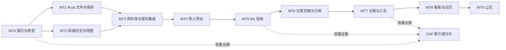

# Shard 多维表格执行计划

日期：2026-09-07。状态：MT1–MT4 代码已接入，MT5 集成验收进行中；M1 尚未完成交付。M2 / M3 未实施。

目标：Shard 只支持多维表格这一种表格产品，在资料库管理具有字段类型、稳定记录 ID 和独立视图的原生文件。CSV / XLSX 是数据交换格式。操作借鉴 Notion、飞书、Teable 和思源，具体取舍与入口约束见 [产品与操作规范](multidimensional-tables-product-spec.md)。旧 Markdown 表格保留源码与阅读兼容，退出独立单元格编辑和 Excel 转 Markdown 入口。

本文件保留范围、架构与验收目标；当前实现和验收快照见 [实现与验收记录](multidimensional-tables-implementation.md)，性能与原型证据见 [试验报告](multidimensional-tables-spike-report.md)。实现验证使用合成数据与临时 vault，不包含提交、push、合并、发布、部署或修改用户现有 vault 数据。每批完成实现与必要验证即可交付，不人为增加阶段批准。涉及新的业务边界时只澄清变化部分。

## 2026-09-08 MT2 交互续作

已按统一产品规范完成列头类型图标/快捷菜单、末列新建字段草稿、内嵌分组标题/折叠/记录数、多行单字段批量修改。所有表单和弹层继续使用共享 Kiln 控件；分组投影、批量事务与剪贴板映射留在 Worker。具体行为和本轮证据见 [产品规范](multidimensional-tables-product-spec.md) 与 [实现记录](multidimensional-tables-implementation.md)。

此续作完成 M1 范围内的统一操作设计；MT5 的真实系统输入法、原生滚动和完整桌面性能门禁仍按原矩阵验收，M2/M3 排期不变。

## 2026-09-08 飞书桌面设计适配

已根据用户打开的本机飞书界面，将视图标签、紧凑工具栏、字段目录与编辑弹层、筛选/排序/分组弹层、记录右键菜单及右侧详情抽屉统一。末行新增与末列新增就近提供入口，现有数据/Worker/保存契约沿用。现场参考及适配边界见 [飞书参考记录](multidimensional-tables-feishu-reference.md)；本轮证据见 [实现记录](multidimensional-tables-implementation.md)。未移植飞书的协作外壳、权限、AI、默认值和子记录；M1 原生完成门继续保留。

## 1. 范围与里程碑

| 里程碑 | 用户能完成的事 | 批次 |
| --- | --- | --- |
| M1：可日常使用的数据表 | 在资料库新建表，编辑行列，使用六种字段类型，保存多份表格视图，筛选/排序/分组，撤销、复制粘贴，导入导出 CSV / XLSX，安全保存与恢复 | MT0–MT5 |
| M2：笔记与多维管理 | 记录详情包含 Markdown 正文，关联已有笔记；跨表关联与汇总；同一批记录切换看板、日历；表与记录可搜索、引用 | MT6–MT8 |
| M3：计算 | 公式字段与依赖重算 | MT9，在 M2 后实施 |
| 容量分支 | 根据实测引入可重建查询索引或记录分片 | CAP，可由 MT0/MT5 或 M2 的性能证据触发 |

M1 必须完成到 MT5 才能称为第一版交付，不能以渲染原型或 mock 测试作为完成。M2、M3 是后续路线，不能混入 M1 实施范围；CAP 只在满足首版容量目标确有必要时提前启动。

当前执行状态：MT0 已形成契约、原型与性能证据，真实中文候选输入等门禁仍待补齐；MT1–MT4 已完成代码接线，集成验证继续由 MT5 收口。MT5 定位的 2 处 UI 竞态已修复，当前全量 UI 与 WebKit 回归已通过执行项；真实 CSV/XLSX 桌面往返已通过，部分原生交互与完整性能链路尚未验收。MT6–MT9 未实施，CAP 未启动。下文各批次的“验收”与“完成门”仍是要求，不代表已经通过。

当前默认：单用户、本地桌面、公开资料库。多人实时协作、移动端、服务器、权限体系、自动化、插件系统、密匣表格、Excel 工作簿格式保真不在本计划的首轮范围内。

## 2. 当前项目基线

以下为计划制定时读取代码确认的接入基础；当前新增实现见实现与验收记录。定位代码使用符号，不依赖历史文档行号。

| 已有能力 | 当前入口 | 本计划怎样使用 |
| --- | --- | --- |
| `notes/` 属于 Git 托管根目录 | `src-tauri/src/lib.rs`：`MANAGED_VAULT_ROOTS`、`managed_pathspecs()` | 新表落在 `notes/`，沿用脏检测与检查点；不另建受管目录清单 |
| 导图为结构化文件，带 ID、revision、hash | 同文件：`read_mind_map_in_vault`、`write_mind_map_in_vault` | 参考文件格式、原子保存和乐观并发；不复制每次按 ID 全库扫描的方式 |
| 原子写入、后台任务、vault gate | 同文件：`write_text_atomically`、`run_blocking`、`lock_vault_gate` | 扩展新表命令；所有重操作离开 UI 线程 |
| 文件管理、回收站与双扩展名处理 | 同文件：`collect_library_entries`、`rename_library_entry_in_vault`、删除/恢复函数 | 增加 `.shardtable.json` 与 `kind: "table"`，覆盖完整生命周期 |
| 资料库选择与第三栏预览分派 | `src/workspace/library-shell.tsx`；`src/components/shard/directory-view.tsx`、`asset-grid.tsx` | 表与 Markdown、导图平级；目录列表/宫格打开表工作区 |
| 保存、导航、检查点、同步、退出协调 | `LibraryDraftHandle`；`src/workspace/workbench-shell.tsx`、`use-vault-sync.ts` | 表格草稿加入同一 flush/dirty 门禁 |
| CSV Worker 与已有文档导入 | `src/lib/csv.ts`、`csv-worker.ts`；后端 `anydoc` 导入通路 | 复用 CSV 解码/解析。XLSX 转 Markdown 的现有导入不能当成类型完整的数据表导入 |
| 片段搜索、wikilink、Markdown 编辑器 | `fragment-search.ts`、`wikilink.ts`、`src/editor/shard-editor.tsx` | M2 显式扩展表/记录目标；不把所有记录伪装成 Fragment |

现有 `docs/dev/server-and-sync-plan.md` 已标记为历史归档。它描述的数据库真相源和服务端不会由本计划恢复。

计划制定时，`workbench-shell.tsx`、`sidebar-nav.tsx/.module.css`、`status-bar.tsx`、`library-tree.spec.ts`、`shadcn-migration.spec.ts`、IA 第十三批文档及 `vendor/kiln` 有未提交改动。后续继续保留已有差异，增量接线，禁止 reset、整文件覆盖或顺带更新 Kiln 子模块。

当前目录树仅显示目录和特殊入口；文件由目录列表/宫格呈现。新增表格不能恢复逐文件侧栏，也不新增一级“数据库”空间。

## 3. 架构决策

| 决策 | 选择与理由 |
| --- | --- |
| 原生模型 | 自有 Table / Field / Record / View 类型，渲染组件只消费投影结果 |
| 第一版磁盘格式 | `notes/<用户目录>/<表名>.shardtable.json`，每表一个文件；一次批量编辑可以原子落盘 |
| 文件名与标题 | 表显示名称来自文件名去掉完整后缀；JSON 不重复保存可独立变化的表名，避免 rename 后两个名称不一致 |
| 标识 | 表、字段、选项、记录、视图均使用稳定随机 ID；改名、移动、排序不改变 ID |
| 数据布局 | 字段/记录/视图按 ID 存映射，显示顺序单独保存；确定性序列化，避免对象枚举顺序制造差异 |
| 保存 | 后端持 gate 校验身份与原始文件 hash，原子落盘；内容写入交给现有 `checkpoint_vault` 聚合提交 |
| 查询 | M1 使用后台内存投影计算筛选/排序/分组，前端接收有序记录 ID；暂不增加 SQLite/libSQL |
| 前端渲染 | 当前实现使用 Glide Data Grid；真实 WKWebView 中文候选输入等关键验收仍待完成。模型与 API 不依赖其行号、cell 类型或主题对象 |
| 备选渲染 | 若 Glide 的输入法/可访问性/主题等关键项不通过，使用 React DOM + TanStack Table/Virtual 评估同一接口；只保留一个正式渲染器 |
| 原始数据与索引 | 文件是唯一真相源；未来索引放在应用本地缓存目录、可删除重建，不进入 Git，不复制 SQLite/WAL 进行同步 |
| 版本控制 | Git 保留文件历史；M1 沿用当前同步冲突处理，不承诺单元格自动合并 |

单文件是首版存储决策，不是永久容量承诺。只有实测证明整表解析/序列化/写盘或跨表查询达到瓶颈，才启动 CAP 的索引/分片设计；提前按记录拆文件会增加多文件事务与恢复成本。

### 3.1 数据契约

以下是结构示意；示例 ID 简写，生产 ID 使用统一的随机 ID 生成器。MT0 固定 DTO、校验规则和跨 Rust/TypeScript 的共同 fixtures。

```json
{
  "kind": "shard.table",
  "schemaVersion": 1,
  "id": "tbl_demo",
  "revision": 1,
  "creation": { "requestId": "req_demo", "payloadHash": "sha256-of-create-input" },
  "lastMutationId": "mut_demo",
  "createdAt": "2026-09-07T00:00:00Z",
  "updatedAt": "2026-09-07T00:00:00Z",
  "primaryFieldId": "fld_title",
  "fields": {
    "fld_title": { "id": "fld_title", "name": "名称", "type": "text" },
    "fld_state": {
      "id": "fld_state", "name": "状态", "type": "select",
      "options": [{ "id": "opt_todo", "label": "待办", "color": "neutral" }]
    }
  },
  "fieldOrder": ["fld_title", "fld_state"],
  "records": {
    "rec_demo": {
      "id": "rec_demo",
      "createdAt": "2026-09-07T00:00:00Z",
      "updatedAt": "2026-09-07T00:00:00Z",
      "values": { "fld_title": "示例记录", "fld_state": "opt_todo" }
    }
  },
  "recordOrder": ["rec_demo"],
  "views": {
    "view_default": {
      "id": "view_default", "name": "全部记录", "type": "table",
      "filters": { "operator": "and", "conditions": [] },
      "sorts": [], "groupBy": null,
      "fieldOrder": ["fld_title", "fld_state"],
      "hiddenFieldIds": [], "columnWidths": {}
    }
  },
  "viewOrder": ["view_default"]
}
```

不变量：

- `schemaVersion` 表示文件格式版本；新增字段、改列名、修改视图只增加内容 revision。
- ID 与位置无关。筛选后的第 3 行不能作为写入身份；编辑事件捕获 `recordId + fieldId`，异步完成时不能重新用可见索引寻址。
- JSON 对象键必须唯一；读取阶段拒绝重复键/重复 ID，不能让默认 JSON 解析器静默覆盖。根级 `fieldOrder`、`recordOrder`、`viewOrder` 必须分别是对应映射键的完整排列，不能缺项、重复或引用不存在的 ID；每个视图的 `fieldOrder` 同样覆盖全部字段，隐藏只由 `hiddenFieldIds` 表达。字段/视图配置引用有效，非法文件报错而非静默遗漏数据。
- 主字段为文本，首版不可删除或变更类型；至少保留一个表格视图。视图配置不复制记录数据。
- 选项使用稳定 ID；改标签/颜色不重写每行单元格。`color` 是受支持的语义枚举，映射 Kiln token，不保存任意 CSS。
- 删除被引用的选项须预览影响记录，明确选择替换或清空后连同单元格一次应用、一次撤销，不能留下失效 optionId。
- 空值统一为缺省或 `null`；空文本、`0`、`false` 不混淆。类型与值由 Rust 再校验，前端校验用于即时反馈。
- M1 字段：文本、有限数值、日期、单选、多选、复选框。日期首版为 `YYYY-MM-DD`，不做隐式时区转换；超出安全整数范围的编号、电话号码、带前导零的值按文本处理。
- M1 只允许空列直接变更类型；非空列的类型转换到 MT7 再增加完整预检。删字段须同时处理该列的值、筛选、排序、分组和显示配置，作为一次可撤销内容修改。
- 未知 `schemaVersion`、未知字段/视图类型、非法值、重复表 ID 显示可定位的错误，不自动降级、不初始化为空表、不选择第一个重复 ID 写入。
- 文件升级在未来新增版本时使用显式迁移函数和 fixtures，保留原件；首次推出本功能不批量迁移现有 CSV、Markdown 或导图。

### 3.2 命令与保存边界

已接入的最小 Tauri API（均为 async command；完整 DTO 见 [数据契约](multidimensional-tables-contract.md)）：

| 命令 | 输入与结果 |
| --- | --- |
| `create_table` | 固定 requestId、预分配新 tableId、当前目录、建议名称、可选初始数据；返回实际 path、初始快照和 hash；同一请求先查幂等结果，再执行文件重名避让 |
| `read_table` | 已校验 path，可选期望 tableId；返回文件快照、revision、原始字节 hash |
| `apply_table_mutations` | path、tableId、expectedRevision、expectedHash、mutationId、有限批量的操作；返回确认后的变更、revision、hash，普通编辑不返回整表 |
| `save_table_copy` | 固定 requestId、预分配新 tableId、显式保留的本地草稿快照与目标目录；后台校验并保留来源信息，返回新 path；不覆盖原表 |

文件列表、rename/move/delete/restore/purge 复用并扩展现有资料库命令。MT4 导入导出命令已接入；查询投影通过专用 Worker 完成，不为每次筛选启动文件扫描。

新建、导入提交、保留副本共享同一幂等创建规则：前端在一个逻辑请求内冻结 requestId/tableId 与 payload，后端将请求标识与规范化输入 hash 保存到 `creation`。响应丢失后按 tableId 核对；同标识同 payload 返回已存在文件，标识相同而 payload 不同报冲突。只有确认尚未创建才执行重名避让。导入预览不创建文件，确认后才分配一次提交身份；取消后重新发起属于新请求。

批量操作只覆盖实际需要的行列/单元格/视图修改，不建设通用事件溯源或插件指令框架。Rust 在内存副本中应用整批、完成全量一致性校验后一次原子写文件；任何单元格无效则整批不写，返回带行/字段位置的错误。

保存协议：

1. 前端维护单表串行队列和草稿 generation。单元格确认后加入队列；复制粘贴、删列等是一组修改、一个撤销步骤。
2. 内容保存沿用当前自动保存节奏，`Cmd+S` 和工作区 flush 立即排空。UI 展示“未保存 / 保存中 / 已保存 / 保存失败 / 冲突”，只有落盘确认才显示已保存。
3. command 获取 vault 后立即 `lock_vault_gate`；确认公开 `notes` 路径、无未完成 Git 操作、目标仍存在、tableId 与 revision/hash 均匹配。禁止省略 expectedHash；写命令不会重建已被外部删除的文件。
4. 校验并落盘后更新 revision/hash；前端只推进已确认 generation 的基线，不用旧响应覆盖其后输入。
5. 结果未知时先 `read_table` 核对 `lastMutationId`，并将完整快照与该批提交时预期内容作后台比较（不以服务端生成的 revision/时间戳作为业务差异）。命中且内容匹配才确认，以返回快照更新基线并保留其后排队修改；只命中 ID 但内容不同仍进入外部变更冲突，不能只换 hash 而保留旧投影。未命中则继续核对版本/冲突，不盲目重发；新行 ID 和 mutationId 在重试时保持不变。
6. 切表、切目录、切空间、打开搜索结果、结构操作、手动/自动同步、检查点和正常退出，均经过现有 `LibraryDraftHandle` 协调。先结束/确认活动单元格，再冻结受影响编辑、flush 到稳定状态；失败保留当前内容和 dirty 状态。
7. 同步后 clean 表重新读取并重建投影；dirty 表保留草稿进入冲突。接受外部版本后清理旧 undo/redo；普通 undo 使用最新已保存基线提交逆向修改，不能恢复旧 hash。

暂存/强退语义：自动保存防抖内尚未确认落盘的编辑仍可能因强退丢失；正常退出必须 flush。故障测试承诺“已确认保存的数据可恢复、写入失败不破坏旧文件”，不承诺内存草稿在断电后全部恢复。M1 不另建草稿日志系统。

### 3.3 Git、文件生命周期与安全

- 表内增删行列、调整视图、编辑单元格均为**内容写入**，不得逐次 Git commit。文件 rename/move/delete/restore/purge 才按现有“结构操作前 checkpoint + 路径级语义提交”执行；保留现有失败降级与 pending 提示。
- 创建与保存、目录快照、脏计数、检查点使用同一 `MANAGED_VAULT_ROOTS`。原子写入临时文件不得出现在资料库条目或提交快照中；成功/失败均清理，崩溃遗留项只针对自身可识别格式安全处理。
- 双扩展名判定、重命名、同名恢复、回收站列表、purge 均增加表类型。改路径不改表/记录/字段 ID；删除与恢复使用同一份原始文件。
- 持有经验证的 path + tableId；rename/sync 后使 ID→path 缓存失效。目录扫描/解析在后台按需执行，不在每次单元格编辑时全库查找。
- 只允许公开 `notes/` 表格；拒绝绝对路径、`..`、越界符号链接、密匣、内部文件与任意回收站路径读写。恢复操作走专用命令。旧密匣内容不自动进入明文表或索引。
- 原始 hash 检查能检测已发生的外部修改；vault gate 只协调 Shard 自身操作，不能声称对任意外部程序提供原子 CAS。M1 不支持多个工具同时改写同一表的强一致性。
- Git 合并成功之后仍校验变更表的 JSON 和模型引用；无效表作为错误条目保留原件，不继续编辑或被下一次自动保存重置。Git rebase 冲突沿用当前失败恢复机制，不自动选 ours/theirs。
- 冲突 UI 至少有“继续保留草稿”“另存副本”“载入磁盘版本”；丢弃草稿必须由用户明确选择。另存副本使用新表 ID，不能产生第二个同 ID 表。

## 4. 产品与界面约束

使用仓库内 [Kiln](../../vendor/kiln/SKILL.md) 及 [表格组件规范](../../vendor/kiln/references/components.md)、[DataTableDock](../../vendor/kiln/references/layouts-and-pages.md)、[平台映射](../../vendor/kiln/references/platform-mapping.md)。字体沿用已本地加载的 Noto Sans SC，不增加 CDN 或其他字体。

- 入口：资料库当前目录的“新建”菜单增加“数据表”。默认创建未命名表并进入编辑，可随后行内重命名；目录列表/宫格与其他文件平级。
- 工作区：第三栏打开，固定表头/视图工具栏，主体独立双轴滚动，底部保留计数、分页和保存状态。空态、加载、错误不会改变工作区高度。
- 数据视图：M1 支持新建/复制/改名/删除多个 table 视图；每个视图独立筛选、排序、单字段分组、列顺序、隐藏与宽度。切换视图不改底层记录顺序。
- M1 不做手动拖行和每视图独立手动行顺序；显式排序的并列项按 `recordOrder` 稳定排列。看板首轮拖动只改变分组字段，组内仍使用既定排序。
- 操作：新增记录、字段管理、搜索、筛选、排序、分组与导入导出按频率安排。多个行操作收进一个菜单；低频设置保持局部面板，不因保存成功自动关闭。
- 输入：Enter 确认、Esc 取消、Tab/Shift+Tab 移动、方向键导航、选区复制粘贴；编辑器内的中文 composition 与文本撤销优先，不能冒泡触发全局捕捉/删除/撤销。
- 粘贴：只写当前投影对应的稳定 ID；允许增加新行，不隐式增加列。超出可编辑列范围、主字段规则或类型规则时先报定位错误；不能静默截断。粘贴后因筛选隐藏的新行给出明确反馈。
- M1 记录详情提供字段表单，宽表/窄窗口也能完整编辑；MT6 再加入 Markdown 正文。窄窗使用表格与详情切换，不叠出不可用的四栏，不触发页面级横向滚动。
- 不改顶部 composer 的滚动协议；表格定位只滚动表格 viewport。普通导航沿用资料库目标，不向 `WorkspaceRoute.library.params` 随意塞新字段。
- Glide 的 Canvas 配色、字体、行高、分隔线、选中/hover/focus 均从实际 Kiln token 映射。禁止直接照搬默认主题；通过主题/密度/字体加载变化触发重绘，重计算只发生在这些变化点。
- Canvas 使用实际行区域的 `--card` 背景，未占用区域延续工作区背景，符合 DataTableDock；不能用整块白色画布再包一张卡片替代此布局。
- 生产键盘焦点必须可见。验证 Canvas 实际绘制与叠加 DOM 编辑器；只检查外壳 computed style 不构成视觉通过。

## 5. CSV / XLSX 交换规则

M1 导入默认为**创建新表**，不覆盖源文件或现有表。追加/合并已有表留到后续有明确映射需求时再做。

1. 选择文件 → CSV 编码/表头确认，或 XLSX 工作表选择 → 字段映射与类型预览 → 校验 → 一次原子创建 → 打开结果。
2. CSV 复用现有 Worker；包含引号、逗号、单元格换行、BOM、UTF-16/GBK、空表和重复列名。重复列名分配独立字段 ID，预览中允许改名；空标题生成可编辑名称。
3. XLSX 必须用结构化解析器读取原始单元格类型与日期信息；不能走 XLSX→Markdown→表格的有损中间链路。MT0 调研并锁定最小 Rust 解析/写出库及许可，避免把整个电子表格引擎引进桌面。
4. XLSX 首版一次选择一张工作表，导入数据值。公式使用可用缓存值并提示来源；缓存缺失/错误则在预览中标出并阻止静默转换，可由用户明确选择作为文本导入。日期系统、合并单元格、错误值、前导零和长编号均有 fixtures；不能用格式猜测后悄悄改值。
5. 不执行宏、外链、公式或网络访问。限制文件大小、解压后大小、行列数和异常展开，超过 MT0 确定的容量直接给出原因，失败不产生半张表。
6. 导出“全部记录”或“当前视图”必须显式区分；当前视图按筛选、排序和可见字段投影，分页只影响显示、不缩成当前页。XLSX 输出一个工作表并保留首版支持的单元格类型。
7. CSV / XLSX 都不是原生备份：视图定义、ID、关联和正文不能无损往返。M1 另提供复制原生 `.shardtable.json` 的导出入口；导入原生副本时分配新表 ID。
8. CSV 首版提供明确标注的“电子表格安全导出”和“原值导出”选项，默认安全模式对可能被当成公式的文本作转义；提示可能影响原值往返。XLSX 文本用显式文本单元格写出，绝不把用户文本自动写成公式。

## 6. 执行批次

### MT0：验证组件并固定契约

**产物**：`docs/dev/multidimensional-tables-contract.md`、`docs/dev/multidimensional-tables-spike-report.md`；隔离的开发试验入口与可复用 fixtures。试验只用临时数据，不写用户 vault。

**任务**：

- 固定第 3 节模型、错误类型、命令、字段值、ID 规则、容量与序列化约定；确定日期/数字/空值比较和筛选运算符，Rust/TS 使用同组 fixtures。
- 核对 Glide 当前 React 19 兼容性、许可、依赖与官方 API，记录精确版本。验证 WKWebView 中文输入、复制粘贴、焦点、键盘、Retina、触控板双轴滚动、可访问性和 Kiln 映射。
- 核对 XLSX Rust 读写库能覆盖 MT4 的 typed value/日期/公式缓存需求，记录版本和许可；只引入所需能力。
- 用第 8 节数据集测读取/IPC、投影、批量保存；将“目标”与“测量结果”分列，记录容量上限与失败行为。

**完成门**：关键输入链路和设计规范均通过才采用 Glide；否则在同一契约上验证唯一备选。这属于已授权实现时的技术选择，不新增常规批准步骤。试验完成后不把全量样例和双渲染器带入正式入口。

### MT1：原生文件、保存与生命周期

**依赖**：MT0 契约。**建议负责**：Rust agent。

**改动面**：`src-tauri/src/table/`（model、validation、mutations、storage）与 `src-tauri/src/table_commands.rs`；`src-tauri/src/lib.rs` 仅做必要的模块/命令注册及资料库生命周期接线。必要时把现有通用原子写 helper 以最小改动暴露给模块，不重构整个后端。

**任务**：模型校验、确定性序列化、后台 create/read/apply/copy；强制 hash/revision；安全路径；表类型识别；rename/move/trash/restore/purge；重复 ID 与坏文件条目；内容与结构提交策略。

**验收**：临时 vault + 真实临时 Git 仓库验证并发旧基线、写入失败、结果未知重试、文件被删除、重复 ID/JSON 键、新版格式、中文双扩展名、恢复重名、内容无微提交和路径限定结构提交；运行相关 Rust 测试与 `cargo check`。

### MT2：表格交互与视图投影

**依赖**：MT0 契约；可与 MT1 并行。**建议负责**：前端 agent。

**改动面**：新增 `src/features/tables/`（模型适配、单表草稿状态、grid、字段设置、记录详情、视图设置）；`src/workers/table.worker.ts`。纯逻辑测试使用 `src/lib/table-model.test.ts`、`table-view.test.ts`、`table-mutations.test.ts`，由当前 `pnpm test:unit` 的匹配规则执行。

**任务**：六种字段、增删记录/字段、选项管理、选区编辑、批量粘贴、撤销/重做；多个 table 视图；筛选/稳定排序/单字段分组/列设置；查询 generation 丢弃旧结果；按稳定 ID 修改记录。

**验收**：mock API 验证编辑和视图行为；中文、零/空/false、多选改名、重复标题、删列回滚、排序/筛选后编辑正确记录、过期查询结果不回灌。此阶段通过不代表文件保存通过。

### MT3：资料库接入与保存闭环

**依赖**：MT1 + MT2。**建议负责**：集成负责人。

**改动面**：`src/types.ts`、`src/lib/api.ts`、`library-shell.tsx`、`workbench-shell.tsx`、`directory-view.tsx`、`asset-grid.tsx`；仅扩展必要的选择/导航目标、预览分派和草稿协调。

**任务**：当前目录新建、列表/宫格预览与打开、恢复选择、记录详情；把表格保存接入 `LibraryDraftHandle`；导航/结构操作/同步/退出稳定 flush；冲突保留副本、载入磁盘；同步后重新校验、刷新并定位。

**验收**：连续快速输入，保存期间再输入，切表/目录/空间、关闭重开、保存失败阻止导航、正常退出保存；手动/自动同步与检查点覆盖新表；外部删除/修改不被迟到保存覆盖。相关 Playwright + 真实 Tauri 临时 vault 闭环均需结果。

### MT4：导入、导出与字段映射

**依赖**：MT1 + MT3；解析 fixture 可提前准备。

**改动面**：`src-tauri/src/table/xlsx.rs`、`src-tauri/src/table_exchange_commands.rs`、`src/features/tables/exchange*.ts/tsx` 与 API/command 注册；复用 CSV 解析基础，不改变现有文档附件导入语义。

**任务**：完成第 5 节流程、局部 loading/cancel、预览类型调整、批量校验、原子创建、CSV/XLSX/原生导出。取消在提交前不写盘，结果未知先核对目标状态。

**验收**：真实 CSV/XLSX fixtures 完成导入→重启→核对值→导出→再次解析；核对总数和全部值，不能只看预览前几行。含长编号、日期系统、公式缓存缺失、中文换行、多选、异常文件、导出全部/视图/分页边界与公式样文本。

### MT5：M1 集成验收与交付

**依赖**：MT3 + MT4。**建议负责**：独立验证 agent，集成负责人修复发现的问题。

**任务**：执行第 8 节完整矩阵；检查同类同步阻塞点；确认临时文件/Git 路径与主线程耗时；持续更新 [实现与验收记录](multidimensional-tables-implementation.md)，全部完成门通过后再标记 M1 交付。

**交付报告**：实现清单、实际命令结果、真实 WKWebView 截图/测量、数据完整性与失败恢复证据、实际容量边界、未实现范围。只写经过验证的状态。

**完成门**：新建→编辑→批量粘贴→多视图→导入导出→文件移动/回收恢复→检查点→重启恢复完整可用；数据安全/中文输入/Kiln/性能门均通过。运行阻塞或失败必须写明，不能用 build 或 mock 代替。

### MT6：记录页面、Markdown 与引用

**依赖**：M1 完成。M2 开始。

**任务**：记录详情加入可选 Markdown 正文，复用 `ShardEditor`；正文首轮作为记录的一个内容字段保存在原生文件中，避免新引入跨文件原子事务。它不自动创建 Fragment。

与已有 Markdown 的连接使用独立 `noteRef` 字段按文档稳定 ID 引用，正文仍归原笔记所有；不自动复制正文或产生两份真相源。记录正文以后若需要独立 `.md` 文件，先设计迁移与跨文件失败恢复，再改变存储。

增加表/记录搜索结果类型与稳定导航目标；wikilink 增加表/记录候选与目标解析，歧义明确提示。片段 relation/backlink 模型不得直接写入不支持的记录 ID。

**验收**：正文与表格字段共用 flush/undo 边界；改名/移动后的引用可用；记录删除后显示断链、恢复后重连；表名/记录标题搜索打开正确目标；原笔记编辑不产生分叉正文。索引后台生成，密匣仍排除。

这里及 MT7 的“记录恢复”限定为保留原 recordId 的会话 Undo、整表 Git 历史恢复或表文件回收站恢复；跨会话单条记录回收站/tombstone 不在 M2 范围内。整表恢复沿用 Git/文件恢复语义，并核对恢复后的引用。

### MT7：跨表关联、汇总与非空字段转换

**依赖**：MT6。

**任务**：relation 保存目标 `tableId + recordId`；首轮支持单向关联和反向派生查询，避免为了同步双向实体而引入双文件写事务。后续若需要显式双向字段配置，再设计跨表一致性。

rollup 定义源关联字段、目标字段与聚合方式，计算结果为派生缓存；关联目标变更/恢复后失效重算。记录删除保留可识别的悬空目标并提示，禁止默认级联删除其他表记录；目标未找到与未加载分开呈现。

非空字段转换先预检，列出无效值与受影响的筛选/排序/分组/关联/汇总；确认后的转换整批原子应用且可撤销，不静默清空。

**验收**：单/多目标、反向查询、目标删除/恢复、缺失表、类型变更、循环引用和汇总传播有有界行为；不因一次单元格编辑扫描/重写全部表；任何部分失败不写半份数据。

### MT8：看板与日历视图

**依赖**：MT7；视图开发可在 MT6 后用 fixtures 并行，最终验收在 MT7 后。

**任务**：看板按单选字段分组，拖动卡片调用既有字段修改；日历按日期字段展示，移动事件调用同一日期写入。添加新 view type，不复制底层记录。

**验收**：表格/看板/日历之间修改立即一致，撤销回到同一记录值；筛选、空组、无日期记录、日期边界、详情导航、窄窗和保存失败路径完整。多选看板、多日事件在有明确需求后扩展。

### MT9：公式

**依赖**：M2 完成。

**公式**：另行界定首批函数与类型规则，建立字段依赖图、循环检测、错误传播、后台增量重算；禁止直接 `eval`、网络访问和执行任意脚本。公式结果为派生数据，文件保存表达式/字段 ID；不承诺兼容 Excel 全部公式。

**验收**：循环依赖、类型错误、目标字段改名/删除、汇总传播、依赖重算与公式错误展示均有确定结果；公式不能改变原始输入或阻塞编辑。

### CAP：按证据扩容

**触发**：与公式批次独立，MT0/MT5 或 M2 出现可复现容量瓶颈即可评估；未触发则不实施。

**扩容触发**：M1 实测容量不足或 M2 查询/正文使保存达到明确瓶颈时，先比较后台内存索引、可重建 SQLite 索引、记录分片。只有选用 libSQL 等依赖时才核对当时版本与兼容性；不恢复历史服务端方案。

**分片前置**：提供旧格式备份、schema 迁移、单表原子性替代方案、崩溃恢复、Git checkpoint 不提交半份事务、回滚和共享 fixtures。不能只把 records 拆目录就称为扩容完成。

## 7. 并行与改动所有权



- MT0 固定 DTO 后，Rust agent 负责 `src-tauri/src/table/`，前端 agent 负责 `src/features/tables/` 与投影 Worker，可并行。
- `lib.rs`、`api.ts`、`types.ts`、工作区壳层和依赖锁文件由集成负责人统一接线；其他 agent 给补丁建议，避免同时修改共享文件。
- 验证 agent 可提前准备临时 fixtures、失败场景和 UI 用例；必须等待真实实现再运行，不用镜像实现的自证测试代替行为验证。
- 若使用隔离 worktree，必须基于当前已核对的工作树状态或明确可复现的补丁基线，不能从旧 HEAD 开始后覆盖用户 IA 改动。具体创建方式在实际实施时决定。

## 8. 验收矩阵

### 8.1 必需场景

| 维度 | 通过标准 |
| --- | --- |
| 数据模型 | Rust/TS 共同 fixtures 一致；null/空串/0/false、日期、选项 ID、无效引用与未知版本均符合契约 |
| 并发保存 | 保存期间继续输入、两个旧 hash 写入、未知响应、切换/退出并发不会丢失已确认数据或重复新增 |
| 失败恢复 | 写入失败保留旧有效文件；坏 JSON、新版 schema、重复键/ID 不被静默覆盖；显式冲突副本可重新打开 |
| 视图 | 筛选/排序/分组只产生投影；编辑命中正确 recordId，旧查询结果不覆盖新视图 |
| 文件生命周期 | 中文/重名/双扩展名 rename、move、trash、restore、purge 保持类型与稳定身份 |
| Git | 内容编辑不产生逐单元格提交；checkpoint 包含新表；结构提交遵循现有协议；临时仓库两份 checkout 的同步成功/冲突结果均经过验证 |
| 导入导出 | 真实文件全量值核对；失败/取消无半成品；视图导出不误缩为当前页；CSV/XLSX 明确有损与安全边界 |
| 输入与可访问性 | 真实 Tauri 中文组合输入、Tab/Enter/Esc、剪贴板、撤销、键盘焦点和可访问名称正常 |
| 布局 | 常规窗口、窄窗、窄高与 Retina；独立滚动、固定工具栏/底部区、无页面溢出；Canvas 与 DOM 均符合实际 Kiln token |
| 回归 | 碎片捕捉、资料库 Markdown、导图、CSV 预览、密匣、侧栏、正常退出与同步保持当前契约 |

### 8.2 性能样本与初始目标

以下仍是验收目标。已测量 Node/V8 数据层 CPU 与 clone 成本，以及真实 Rust 临时 vault 的读取、单格编辑和批量粘贴原子保存，详见 [试验报告](multidimensional-tables-spike-report.md)。B 样本的后端暖态保存 p95 已低于 1 秒；冷开表、输入到像素反馈和完整 IPC/UI 链路尚未测量，不能据此宣称整体容量验收通过。

- A：1,000 行 × 20 列；B：10,000 行 × 30 列；C：50,000 行 × 30 列作为压力探索，不自动列为 M1 支持承诺。包含中文、多选、空值和长文本，不能全用短数字。
- M1 至少覆盖 A、B 的完整读写与视图操作。初始目标：B 冷开表 ≤ 2 秒；常见筛选/排序 ≤ 1 秒；单元格确认到可见反馈 p95 ≤ 100 ms；落盘确认 p95 ≤ 1 秒（不含防抖等待）。每类重复至少 20 次并报告分布。
- 1,000 × 10 单元格粘贴作为一次修改，后台校验/落盘期间 UI 可响应、有局部进度；取消是否仍可用按写入阶段真实显示。
- 不在 render/event handler 中进行全量排序、JSON 序列化、Markdown 解析、文件 I/O 或 Git。测量 IPC/structured clone 与投影回传的主线程成本；避免“放进 Promise”却仍同步执行重工作。
- MT0 定出行/列/文件字节数硬上限，并在前后端及导入前一致执行；若 B 达不到目标，修复瓶颈后复测，或交付明确的限制与差距，不悄悄降低样本冒充通过。

### 8.3 命令与证据

代码实施阶段按批次运行相关检查；跨壳层集成后的 M1 最终门禁：

```bash
pnpm build
pnpm test:unit
cargo check --manifest-path src-tauri/Cargo.toml
cargo test --manifest-path src-tauri/Cargo.toml
pnpm test:ui
git diff --check
```

已新增 `tests/ui/table-workspace.spec.ts`、`table-spike.spec.ts`、`table-exchange.spec.ts`，并增量覆盖资料库与布局回归；M2 的 wikilink 扩展尚未实施。Rust 测试使用临时目录和临时 Git 仓库。全量 UI 检查只在集成门禁或新失败需要时重复，当前失败与跳过项见实现与验收记录。

Playwright mock 验证交互，真实 Tauri 临时 vault 验证落盘、重开、同步、退出和故障；二者分别报告。所有故障注入和 Git 往返使用测试数据，不在用户真实 vault 演练。

实现与验收结果单独记录，不能将本节命令清单视为已经执行或通过。此次状态文档更新只检查差异、链接和规则一致性，不改变既有性能证据。

## 9. 开源参考与复用边界

以下入口在本轮调研中核对；实施时记录实际版本/commit 和目标目录许可，不直接从分支最新版本复制代码。

| 项目 | 参考入口 | 本计划采用的思想 |
| --- | --- | --- |
| 思源 | [kernel/av](https://github.com/siyuan-note/siyuan/tree/master/kernel/av)、[av.go](https://github.com/siyuan-note/siyuan/blob/master/kernel/av/av.go) | 稳定字段/记录/视图身份、JSON 文件、关联与汇总的显式结构 |
| Teable | [core models](https://github.com/teableio/teable/tree/develop/packages/core/src/models)、[LICENSE](https://github.com/teableio/teable/blob/develop/LICENSE) | field/record/table/view/aggregation 分层；核对具体 MIT package 后才考虑代码复用 |
| AFFiNE / BlockSuite | [data-view](https://github.com/toeverything/AFFiNE/tree/canary/blocksuite/affine/data-view/src)、[database model](https://github.com/toeverything/AFFiNE/tree/canary/blocksuite/affine/model/src/blocks/database)、[LICENSE](https://github.com/toeverything/AFFiNE/blob/canary/LICENSE) | 数据源、字段、视图分离；保留 Shard 自己的 React 与存储体系 |
| AppFlowy-Collab | [database entity](https://github.com/AppFlowy-IO/AppFlowy-Collab/blob/main/collab/src/database/entity.rs)、[LICENSE](https://github.com/AppFlowy-IO/AppFlowy-Collab/blob/main/LICENSE) | Rust 实体、独立视图配置；不把 CRDT 同步引擎作为 M1 依赖 |
| Glide Data Grid | [仓库](https://github.com/glideapps/glide-data-grid)、[API](https://github.com/glideapps/glide-data-grid/blob/main/packages/core/API.md) | React 表格交互候选，使用适配层承接稳定 ID 与字段类型 |
| TanStack | [Table](https://github.com/TanStack/table)、[Virtual](https://github.com/TanStack/virtual) | Glide 关键门禁不通过时的唯一备选路线 |

思源与 AppFlowy-Collab 当前为 AGPL；Teable 应用为 AGPL、`packages/` 为 MIT；AFFiNE 普通目录/BlockSuite 与后端等目录有不同许可；Glide 为 MIT。架构参考与代码复用分别记录；本计划不批准将第三方整套产品或品牌资源搬入 Shard。
